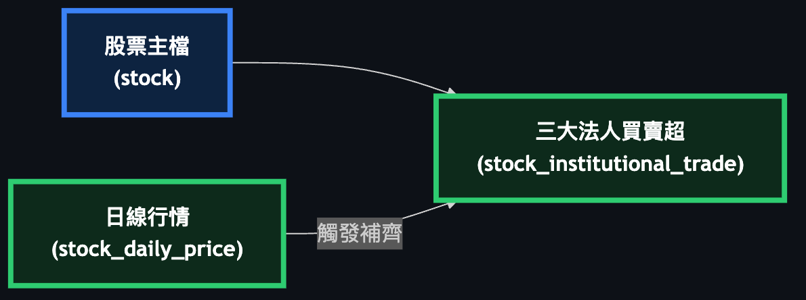

# 股票資料系統整合藍圖

本文件整合以下 9 份 backend spec，把它們視為同一個系統的不同切面來閱讀：`stock-price-ingestion`（日線抓取與回補）、`stock-catalog`（股票清單查詢與人工維護）、`stock-indicator-statistics`（MACD／KD 指標運算與統計）、`stock-minute-price`（分 K 隨選抓取）、`stock-universe-import`（上市股票與產業別匯入）、`industry-gain-ranking`（產業別漲幅排行）、`strategy-scan`（策略型態掃描，含三個法人籌碼型態與兩個技術指標型態）、`strategy-backtest`（策略命中回測）、`institutional-trade-ingestion`（三大法人買賣超抓取與補齊）。

整合後，這個系統的樣子是：一份**股票主檔**（有哪些股票），外加圍繞它累積的四份時間序列資料——**日線行情**、由日線推導出的**技術指標**、隨選抓取的**分 K 行情**，以及**三大法人買賣超**。日線行情是整個系統的行情骨幹：指標由它推導、產業別漲幅排行讀它、策略掃描與回測讀它，三大法人買賣超的補齊時機與範圍也由它決定。策略掃描這一層本身不落地任何資料，但它現在有兩種讀法：五個價格型態與三個法人籌碼型態直接讀日線與法人買賣超；新加入的兩個技術指標型態（MACD 黃金交叉、KDJ 黃金交叉）則在掃描當下由日線**即時**推導 MACD／KD，刻意繞過已落地的指標表——見第 4 節與第 5 節。

---

## 2. 全景關係圖

這張圖是整份文件的目錄：8 份資料方塊中，粗框的三個（股票主檔、日線行情、三大法人買賣超）是本系統選股功能的核心資料；其餘是圍繞它們衍生或輔助的資料。箭頭只表達「誰的存在或誰的內容決定了誰」，細節留給第 3 節。

---

## 3. 資料分節說明

### 3.1 股票主檔（stock）

*（節錄自完整架構圖）*

股票主檔是整個系統唯一的「有哪些股票」清單，其餘所有資料（行情、指標、分 K、產業別、法人買賣超）都以它的代號為依附鍵。它有三個各自獨立的寫入來源：每日增量抓取行情時順帶維護代號與名稱、使用者按「更新股票清單」時批次匯入全市場上市普通股與產業別、以及使用者在總覽頁手動新增／修改／下市單一股票。三者對同一張表的權責刻意切開——自動化的兩條路徑（每日增量、清單匯入）絕不觸碰「是否在市」，只有人工路徑能改變股票的在市狀態；下市是軟刪除，行情與指標歷史一律保留。這種多來源同寫一張表、且刻意互不越權的寫入型態，是它需要專屬詳細圖的原因。

詳細欄位、規則與 API 定義 → docs/backend/stock-catalog.md

### 3.2 日線行情（stock_daily_price）

*（節錄自完整架構圖）*

日線行情是整個系統的行情骨幹：指標運算、產業別漲幅排行、策略掃描（含價格型態與即時推導的技術指標型態）、策略回測全部只讀它，不另外對外抓資料。它的寫入路徑是全系統最複雜的一塊——每日增量走交易所單一請求的全市場快照、全市場回補以逐日全市場快照為主路徑、指定多檔與逐日快照失效時的降級皆走 Yahoo／FinMind 雙來源逐檔查詢，任一來源被封鎖時會自動切換或降級，且不會讓整批作業中止。**每一次日線批次（不論來源是啟動、手動、或每日增量）結束後，都會在背景帶動三大法人買賣超的補齊；但技術指標的自動重算只掛在系統啟動的補齊流程上**，手動同步或每日增量並不會自動連動指標重算——這條分界容易被誤讀成「回補完就自動重算」，詳見第 5 節情境一。

詳細欄位、規則與 API 定義 → docs/backend/stock-price-ingestion.md

### 3.3 MACD／KD 指標（stock_daily_indicator）

*（節錄自完整架構圖）*

技術指標由日線行情遞迴推導而成，本質上是日線行情的衍生資料，只服務一種用途：把固定參數（MACD 12／26／9、KD 9／3／3）算好落地，供兩個月統計查詢直接讀取。它的特殊之處在於「自動接力」：只有系統**啟動**的日線補齊完成後，才會在背景對全市場觸發一次指標重算，且是逐檔判斷該用全量重建還是增量推進（沒有任何指標列的股票只能全量重建，已有指標的股票才能增量）——這個逐檔分流決策，加上「找不到前一日狀態時不得以初始值起算、必須改標記全量重建」這條防止污染遞迴鏈的規則，是它需要專屬詳細圖的原因。

**策略掃描的兩個技術指標型態（MACD 黃金交叉、KDJ 黃金交叉）不讀這張表。** 它們在掃描當下直接從日線收盤價即時重新推導 DIF／DEA／OSC 與 K／D／J，只與這裡的運算共用同一套公式實作（見第 4 節），資料流向完全獨立。這樣掃描結果就不會被「指標重算排程上一次跑到哪裡」這種與掃描本身無關的因素牽動，也才能讓使用者自訂 MACD 的快、慢 EMA 天數——落地表只固定一組參數，答不了這個需求。

詳細欄位、規則與 API 定義 → docs/backend/stock-indicator-statistics.md

### 3.4 分 K 行情（stock_minute_price）

*（節錄自完整架構圖）*

分 K 行情走的是與日線完全不同的策略：不排程主動全抓，而是使用者在日 K 圖上點選某一個交易日時才「隨選」向外部抓取，抓過即永久落地，第二次以後純讀資料庫。依日期落在「30 天內」「30 天以前」「更早」三段，分別導向 Yahoo、富果或直接回覆「超出範圍」，兩個來源互不備援。這個依日期分流、且需要另一份狀態表決定是否重抓（今日資料在收盤前會重抓）的機制，是它需要專屬詳細圖的原因。

詳細欄位、規則與 API 定義 → docs/backend/stock-minute-price.md

### 3.5 分 K 抓取狀態（stock_minute_fetch_status）

*（節錄自完整架構圖）*

這是分 K 行情的控制表，記錄每一個「股票 × 交易日」組合目前的抓取結果（已有資料、當日無成交、超出可取得範圍、非交易日、抓取失敗）與重試次數。它本身是單純的狀態記錄，沒有跨資料的效應，實際的抓取決策已完整畫在上一節的詳細圖裡，此處不重複。

詳細欄位、規則與 API 定義 → docs/backend/stock-minute-price.md

### 3.6 產業別（industry／stock_industry）

*（節錄自完整架構圖）*

產業別描述每檔股票所屬的交易所官方分類，供產業別漲幅排行分組使用。它與股票主檔由同一支「更新股票清單」一起維護，理由是兩者是同一個使用者動作的兩半，拆成兩個動作只會製造「清單已更新、分類還沒更新」的中間狀態。寫入採整組取代（先刪除本次來源涵蓋到的股票的既有關聯，再寫入新的），但只限縮在本次來源有涵蓋到的股票，不影響其餘股票的既有分類。這是單一寫入路徑、無跨資料觸發的資料，已併入 3.1 的詳細圖中一併呈現，不另畫獨立圖。

詳細欄位、規則與 API 定義 → docs/backend/stock-universe-import.md

### 3.7 三大法人買賣超（stock_institutional_trade）

*（節錄自完整架構圖）*

這份資料供策略掃描的三個法人籌碼型態（法人買賣超佔比、法人連續買超、法人買超強度排名）使用，判定外資（不含外資自營商）與投信的買賣超佔比、是否連續買超、以及買超強度排名，分母皆取自日線的成交股數。它自交易所三大法人買賣超日報抓取，且**不是使用者主動觸發的功能**，而是掛在既有日線抓取流程上的背景步驟：每一次日線批次結束、或每日增量成功寫入後，都會在背景自動補齊一次，範圍以日線行情已有的交易日為準、只補缺少的日期，沒有自己的對外端點也沒有自己的進度表——「那一天有沒有任何一列」直接反推是否已抓過。這種「由別的動作結束時被動觸發」的補齊方式，是它需要專屬詳細圖的原因。

三個法人籌碼型態命中後回報的進場日一律是訊號日的下一個交易日，因為三大法人日報收盤後才發布，不能用當天收盤價買一檔要等收盤後才公布籌碼的股票——這與技術指標型態「訊號日當天收盤即可買進」的規則刻意不同（技術指標以收盤價判定，收盤當下即已知道成立）。

詳細欄位、規則與 API 定義 → docs/backend/institutional-trade-ingestion.md

### 3.8 同步進度（stock_sync_progress）

*（節錄自完整架構圖）*

這是一張跨多種批次作業共用的進度表，逐檔記錄每一種工作類型（日線回補、指標重算）目前的狀態與重試次數，供斷點續傳與畫面上的完成度顯示使用。它本身不是任何單一功能的核心資料，而是一個被多個批次共用的追蹤機制，詳細行為見第 4 節的通用模組說明。

詳細欄位、規則與 API 定義 → docs/backend/stock-price-ingestion.md

---

## 4. 通用／可重用模組

**批次進度與併發控制（stock_sync_progress）**：日線回補與指標重算共用同一套「依作業類型區分、逐檔記錄狀態」的進度追蹤機制，且各自的併發鎖互不影響（同一時間可以有一個回補與一個指標重算同時執行，但不能有兩個回補同時執行）。「只處理未完成的標的」與「依進度日期接續、讓已完成但落後的標的重新開啟」是兩種不同的續傳判斷依據，刻意不能同時使用。三大法人買賣超的補齊刻意不使用這套機制——它靠「那一天有沒有任何一列」直接反推是否已抓過，理由是另建一份進度表反而可能與資料本身不一致。

**請求節流與來源封鎖切換**：每個外部來源各自維持請求間隔與封鎖狀態，其中一個被封鎖不會拖慢另一個。唯一的例外是交易所的逐日全市場快照與三大法人買賣超日報：兩者打的是同一個交易所主機，而封鎖是那個主機對本機施加的，因此它們共用同一道請求間隔與同一份封鎖狀態——任一方觸發封鎖，另一方也立即停止對該主機發出請求。Yahoo、FinMind 與分 K 的富果來源則各自獨立計算。

**普通股篩選**：判斷「代號恰為 4 位數字、且首字元不為 0」是否為普通股，這條規則由股票清單匯入時建立，之後被日線回補、股票清單查詢、產業別漲幅排行、策略掃描共用同一份實作，全系統只有一處定義，避免同一種篩選出現多套邏輯彼此漂移。

**MACD／KD 公式實作**：指標運算（3.3）與策略掃描的兩個技術指標型態（MACD 黃金交叉、KDJ 黃金交叉）共用同一套遞迴公式——DIF／DEA／OSC 的定義、K／D／J 的初始值與 RMA 平滑方式必須完全一致，這樣使用者才不會在日 K 圖的指標曲線與策略掃描的命中之間看到兩個對不起來的交叉日。但兩者的**資料流向刻意不同**：指標運算把結果算好、落地在 指標表，固定一組參數（MACD 12／26／9、KD 9／3／3）供統計查詢直接讀取；策略掃描則在掃描當下由 日線行情 的收盤價**即時重算**，不讀也不寫 指標表。這不是巧合的兩套邏輯，而是同一份公式在兩個不同的呼叫點——落地表回答不了掃描允許呼叫端自訂 MACD 快、慢 EMA 天數這件事，而且落地表的涵蓋範圍取決於指標重算排程何時跑過，若掃描讀它，掃描結果會被一個與掃描完全無關的排程時間點牽動。**因此本文件在描述「策略掃描讀什麼」時，一律是「日線行情」，而不是「日線行情與已存的指標」——這一點刻意與底底高型態共用的 MA5（同樣即時算、同樣不落地、同樣不碰 指標表）道理一致。**

---

## 5. End-to-End 情境走查

**情境一：手動「同步日 K 至今日」會自動帶動法人資料補齊，但指標重算不會**
使用者在策略分頁按「同步日 K 至今日」→ 全市場回補寫入日線行情、推進同步進度 → 批次結束後，不論它是啟動補齊、這次手動觸發、還是每日增量，都會在背景自動觸發一次三大法人買賣超補齊（以日線已有的交易日為準，只補缺少的日期）。**但指標重算不會被這次手動觸發自動帶動**——自動重算只掛在系統啟動的補齊流程上；手動同步之後若要讓 MACD／KD 也更新到最新，需要另外呼叫指標重算。這條分界容易被誤解成「回補完就自動重算」，因此特別在此寫明。

**情境二：系統啟動時的自動接力**
應用程式啟動完成 → 先以交易所每日快照自動同步股票主檔（讓股票清單從開發種子擴充為全市場）→ 接著對全部上市普通股觸發日線啟動補齊（逐日快照為主，任一來源被封鎖時自動切換或降級為逐檔，全程不阻塞應用程式開始服務）→ **這次啟動補齊的行情批次結束後**，才自動接力觸發全市場指標重算（逐檔判斷全量或增量）與三大法人買賣超補齊。使用者開站時看到的「可用系統」，是依序自動接力的背景步驟疊出來的結果，過程中沒有任何一步需要人工介入。

**情境三：更新股票清單與同步日 K 是刻意分開的兩個動作**
使用者按「更新股票清單」時，系統只寫入股票主檔的代號名稱與產業別分類，**刻意不寫入任何行情**——即使來源回應裡就附帶當日成交價。理由是要讓使用者自己決定何時開始長時間的行情回補，順手寫入會讓日線行情出現「只有某一天、前後都沒有」的孤立列，破壞指標的遞迴推進。新股票要等使用者下一次按「同步日 K」時才會真正取得行情，這是分工設計刻意造成的延遲，不是缺陷。

**情境四：分 K 隨選抓取與重抓判斷**
使用者在日 K 圖上點開某一個交易日 → 系統先查分 K 抓取狀態判斷是否需要重抓（今日資料在收盤前會重抓、其餘已抓過的日期直接讀資料庫）→ 依目標日期落在「30 天內」「30 天以前」「更早」分流到 Yahoo、富果或直接回覆超出範圍 → 抓到的資料連同狀態一起落地。第二次點開同一天，系統完全不對外發出請求，直接讀庫。

**情境五：成交量口徑不一致，只影響法人籌碼型態，不影響技術指標型態**
全市場回補進行中，若逐日快照來源被封鎖，系統會自動降級為 Yahoo／FinMind 逐檔繼續完成整批作業，不會中止。但兩種抓法的成交量口徑不同（Yahoo 系統性偏低，交易所快照才是全額成交量），而三個法人籌碼型態的佔比與強度都以成交量為分母，落在偏低口徑列上的比率會被高估，命中與名次隨之偏移。這個差異不會被自動修正，需要之後對整段歷史打一次全市場回補，讓全庫統一回交易所口徑。**MACD 黃金交叉與 KDJ 黃金交叉只吃收盤價，不吃成交量，因此完全不受這個口徑差異影響**——這是判斷「哪些型態需要等重補完成才可信」時的一條分界線。

**情境六：技術指標型態掃描不需要等指標重算排程跑過**
使用者在策略分頁勾選「MACD 黃金交叉」或「KDJ 黃金交叉」並自訂 EMA 天數執行掃描 → 掃描服務直接讀取 日線行情 的收盤價，於掃描當下即時遞迴推導 DIF／DEA／OSC 與 K／D／J（暖身最多回看 250 個交易日），完全不查詢、也不依賴 指標表 目前重算到哪一天 → 命中當日即為訊號日，也是進場日（技術指標以收盤價判定，收盤當下已知道成立，不像法人籌碼型態要等次一交易日）→ 前端接著送出回測，以命中日收盤買進。這代表即使系統剛啟動、指標重算作業還沒跑完，這兩個技術指標型態依然能立刻給出正確的掃描結果——因為它們的資料來源與計算時機和落地的指標表完全脫鉤。

---

## 6. 延伸閱讀

| 章節 | 對應文件 |
|---|---|
| 3.1 股票主檔 | docs/backend/stock-catalog.md |
| 3.2 日線行情 | docs/backend/stock-price-ingestion.md |
| 3.3 MACD／KD 指標 | docs/backend/stock-indicator-statistics.md |
| 3.4 分 K 行情 | docs/backend/stock-minute-price.md |
| 3.5 分 K 抓取狀態 | docs/backend/stock-minute-price.md |
| 3.6 產業別 | docs/backend/stock-universe-import.md |
| 3.7 三大法人買賣超 | docs/backend/institutional-trade-ingestion.md |
| 3.8 同步進度 | docs/backend/stock-price-ingestion.md |
| （讀取端，未落地資料；策略掃描的技術指標型態即時推導、不讀 3.3） | docs/backend/industry-gain-ranking.md、docs/backend/strategy-scan.md、docs/backend/strategy-backtest.md |
