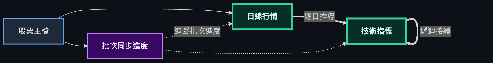
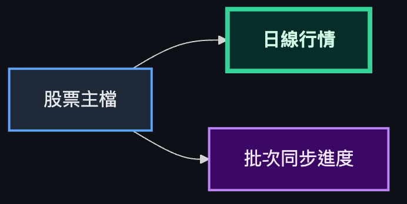
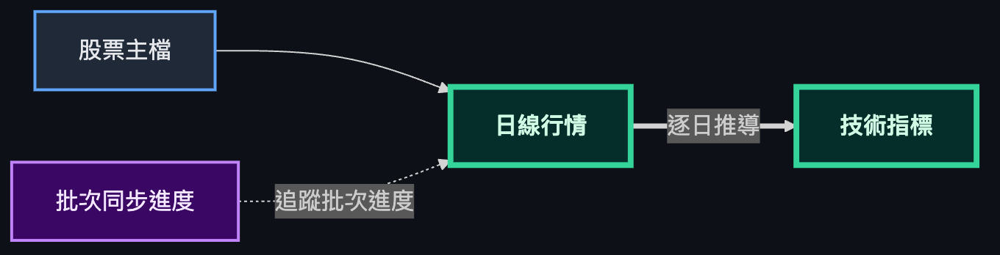
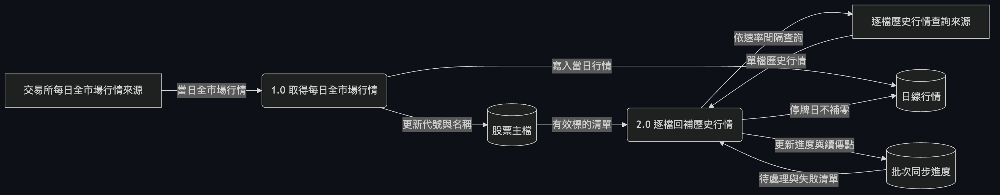
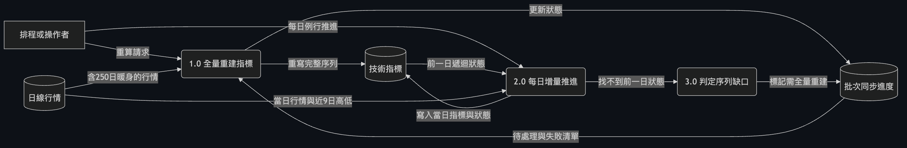
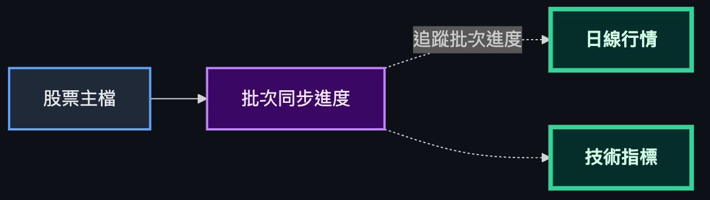
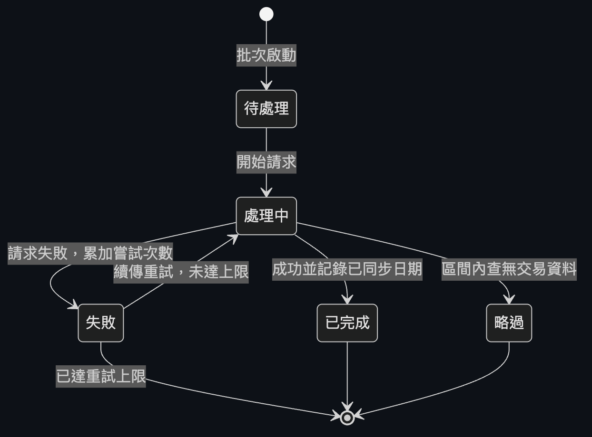

# 股票行情與技術指標系統 — 整合系統藍圖

本文件整合 `specs/backend/stock-price-ingestion.md`（股票行情抓取與回補）與 `specs/backend/stock-indicator-statistics.md`（MACD／KD 指標運算與兩個月統計）兩份規格，將兩者視為同一套系統的前後兩個階段——「行情入庫」與「指標推導與統計查詢」——而非兩個獨立功能。整合後的系統樣貌是：外部行情資料經由單一入口寫入日線行情，技術指標完全由系統自行從日線行情遞迴推導（不假外部指標來源），兩種批次作業（行情回補、指標重算）共用同一套逐檔進度追蹤與斷點續傳機制。本文件只呈現跨資料實體的整體關聯與端到端行為，不重複欄位、驗證規則與 API 完整契約，那些留在各章末指向的 `docs/backend/` 文件。

## 全景關係圖

這張圖是全文件的目錄：系統中只有四個資料實體，股票主檔提供股票代號與名稱作為其餘三者共用的邏輯鍵值；日線行情與技術指標是業務真正關心的核心資料，兩者以「逐日推導」串接，技術指標本身又靠「遞迴接續」向前展開；批次同步進度是支撐性的基礎設施，以虛線表示它「追蹤」兩種批次作業的逐檔進度，而非參與資料流。**這個 schema 刻意沒有資料庫層級的外鍵**，圖中所有連線都只表示「以股票代號為準的邏輯關聯」，不是結構性約束。

## 3.1 股票主檔

*（節錄自完整架構圖）*

**說明**：股票主檔記錄每一檔股票的代號與名稱，是系統中唯一的「標的名冊」——所有其他實體（日線行情、技術指標、批次同步進度）都以股票代號回頭對照這裡取得名稱或判斷是否為有效標的。它不是獨立抓取的資料，而是每日全市場行情處理過程中順帶維護的副產品：來源同時回傳代號與名稱，因此不需要另一個資料源。它在全景圖中的位置是上游錨點，日線行情與批次同步進度的「全市場」語意都以此表為準。股票主檔的維護是單純的單表新增／更新，沒有跨實體的特殊流程，因此不另外畫詳細圖。

詳細欄位、規則與 API 定義 → docs/backend/stock-price-ingestion.md

## 3.2 日線行情

*（節錄自完整架構圖）*

**說明**：日線行情是整個系統唯一的資料入口，儲存每檔股票每個交易日的原始成交價（不還原除權息）與成交量，技術指標的所有運算都以這裡的資料為輸入，不另行對外抓取。它有兩條完全不同的入庫路徑：每日收盤後以一次外部請求取得全市場當日行情；系統初次建置或補歷史時則必須逐檔查詢，且外部資料源的免費層不支援一次取得全市場。這兩條路徑、逐檔請求的速率限制、中斷後的續傳、以及停牌日不補零的規則，都是非顯而易見的行為，值得展開一張詳細圖。

**流程說明**：每日全市場行情由單一請求一次取得，直接正規化後寫入股票主檔與日線行情，不需要進度追蹤。逐檔回補則先從股票主檔取得有效標的清單、從批次同步進度取得待處理與失敗中的標的，再依可設定的請求間隔逐檔查詢歷史資料；當外部來源回應請求過於頻繁或逾時，流程會退避後重試而非直接判定失敗。資料源當天沒有回傳的日期代表停牌或無交易，系統不補零、也不建立該列。每一檔的資料寫入與進度更新落在同一個交易邊界內完成，避免「資料已寫入但進度未更新」導致重跑時重複打外部請求。

詳細欄位、規則與 API 定義 → docs/backend/stock-price-ingestion.md

## 3.3 技術指標

*（節錄自完整架構圖）*

**說明**：技術指標儲存由日線行情推導出的 MACD 與 KD 數值，同時落地遞迴中間狀態（EMA 快慢線、K／D 值），供隔天增量推進使用。它是業務上「統計 MACD／KD」的實質內容所在——區間摘要與交叉次數都由這裡的序列計算而來。因為 MACD／KD 都是遞迴指標，序列開頭的值不可靠，必須從統計起日往前多算 250 個交易日暖身；每日例行更新則不是重算整條序列，而是讀取前一交易日的狀態推進一天。這些機制（暖身、遞迴推進、缺口處理）決定了指標值是否可信，因此展開詳細圖。

**流程說明**：全量重建用於初次建置或參數變更，會從暖身起點（統計起日往前 250 個交易日）重新讀取日線行情、捨棄該檔既有指標列、寫入含暖身標記的完整序列。每日增量推進是例行路徑，只讀取前一交易日的遞迴狀態與最近 9 個交易日的高低價，加上當日行情推進一步後寫入，成本與歷史長度無關。若增量推進時發現前一交易日的指標列不存在（序列出現缺口），系統不會用假設的初始值頂上，而是把該檔標記為需要全量重建，交由重建流程從暖身起點重新推導整條序列。

詳細欄位、規則與 API 定義 → docs/backend/stock-indicator-statistics.md

## 3.4 批次同步進度

*（節錄自完整架構圖）*

**說明**：批次同步進度是行情回補與指標重算兩種長時間批次作業共用的逐檔進度紀錄，主鍵是「一檔股票 × 一種作業」。它存在的直接原因是外部歷史行情查詢不支援一次取全市場，全市場回補必然是耗時的逐檔作業，會因速率限制、網路中斷或程序重啟而中途停止；沒有這張進度紀錄，每次中斷都只能整批重跑。它在全景圖中同時面向日線行情與技術指標，因為兩種作業各自獨立記錄進度、互不干擾。狀態之間的流轉規則（何時可重試、何時永久跳過）並不直觀，值得用狀態圖說明。

**流程說明**：批次啟動時，目標標的（多選清單或全市場有效標的）被建立或重置為待處理狀態。逐檔開始處理時轉為執行中，成功則轉為完成並記錄已同步到的交易日，請求失敗則轉為失敗並累加嘗試次數，該檔在目標區間內完全查無交易資料則轉為略過且不再重試——失敗與略過刻意分開記錄，避免重試排程反覆嘗試永遠不會成功的標的。續傳時只挑選待處理與失敗中、且嘗試次數未達上限的標的重新處理，並從各檔記錄的已同步日期之後接續，已完成的標的不會再發出外部請求。

詳細欄位、規則與 API 定義 → docs/backend/stock-price-ingestion.md

## End-to-End 情境走查

**情境一：全市場歷史回補中途中斷後續傳**
全市場回補是約 2200 次逐檔外部請求的長時間作業，中途因速率限制、網路問題或程序重啟而停止是預期中的常態，不是例外情況。系統不會因此整批重跑：批次同步進度表記錄了每一檔股票已經成功處理到哪一個交易日。重新以續傳模式呼叫回補時，系統只挑出仍在待處理或失敗狀態、且嘗試次數未超過上限的標的，並且是從各檔記錄的已同步日期之後接續查詢，而不是從回補區間的起日重新開始——已完成的標的完全不會再產生外部請求。這正是批次同步進度這張表存在的唯一理由。

**情境二：輸出兩個月指標卻要多算 250 個交易日暖身**
MACD 與 KD 都是遞迴指標，序列剛開始的值是由人為設定的初始值起算，還沒有收斂到真實值，如果直接從統計起日開始算，前面幾天甚至前面幾週的數值都是失真的。系統的作法是往前多抓 250 個交易日一起運算，讓遞迴狀態在到達真正的統計起日之前已經收斂完成。這段暖身期間產生的指標列確實會寫入資料庫，但會標記為暖身資料，統計查詢一律排除這些列，呼叫端完全看不到、也不需要處理它們——暖身的作用只在計算過程中發揮，不對外呈現。

**情境三：每日收盤後的例行更新**
每個交易日收盤後的例行路徑分兩段：先以單一請求取得當日全市場行情，一次寫入所有股票的日線行情與股票主檔；接著針對每一檔股票，讀取它前一交易日留下的遞迴狀態（EMA 快慢線與 K／D 值）與最近 9 個交易日的高低價，配合當日行情推進一天，寫入當日的指標值。這條路徑不會重算整條歷史序列，成本只與股票檔數有關、與各檔歷史長度無關，這也是它能夠每天例行執行、而不需要跑完整重建流程的原因。

**情境四：指標序列出現缺口時不能用初始值補算**
如果某一檔股票在增量推進時，找不到前一交易日的指標紀錄（例如中間漏算或資料被清除造成序列斷裂），系統不會用一個假設的起始值（例如 KD 常見的中性值）接著往下推進。因為那個假設值本身還沒有經過任何收斂，如果就這樣接上遞迴鏈往後算，之後每一天的數值都會沿著這條錯誤的起點被污染，而且不會自己修正回來。正確的處理方式是把這一檔標記為需要全量重建，讓它從暖身起點重新推導一次完整序列，確保每一天的值都是真正收斂後的結果。

**情境五：停牌日沒有資料時不能補零**
外部行情來源在股票停牌或當天無交易時，根本不會回傳那一天的資料列，系統對此的處理方式是不寫入這一列，而不是補上一列價格為零的紀錄。原因在於零價格會直接破壞指標計算：KD 需要最近幾天的最高價與最低價，一旦有一天的價格是零，最低價的計算就會被拉到零，做出完全失真的結果；MACD 則會因為價格從正常值瞬間掉到零，被誤判為一次劇烈的暴跌，產生原本不存在的死亡交叉訊號。這些錯誤訊號會一路污染後續的交叉次數統計與所有依賴指標判斷的下游使用情境，所以停牌日寧可讓序列上直接沒有那一天，也不能用零去填補。

## 延伸閱讀

| 章節 | 對應文件 |
|---|---|
| 股票主檔 | docs/backend/stock-price-ingestion.md |
| 日線行情 | docs/backend/stock-price-ingestion.md |
| 技術指標 | docs/backend/stock-indicator-statistics.md |
| 批次同步進度 | docs/backend/stock-price-ingestion.md |
