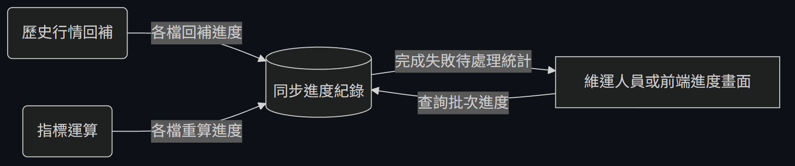
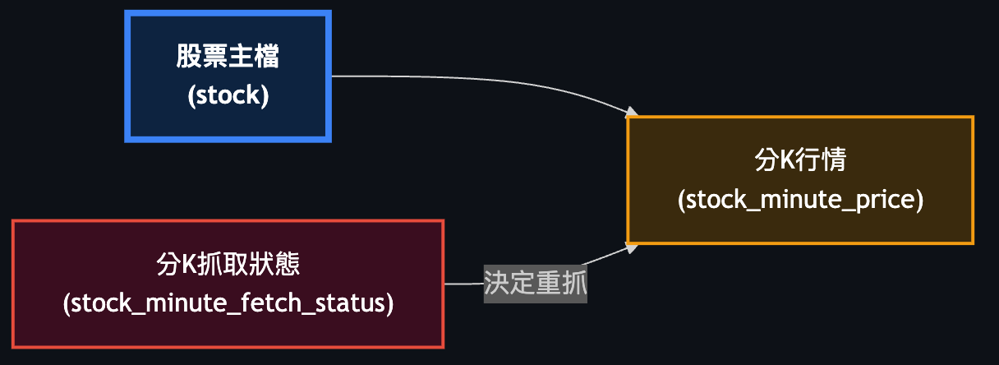
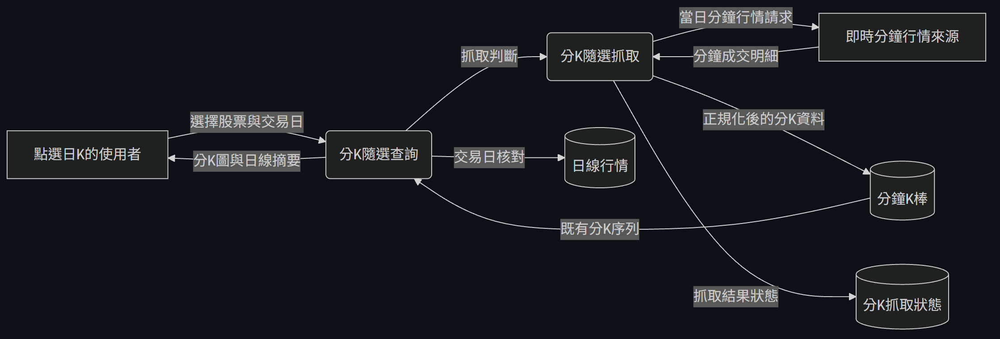
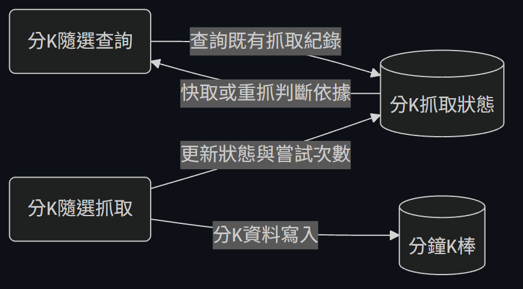

# 股票監控系統 — 全系統整合藍圖

## 1. 文件目的

本文件整合五份後端規格，涵蓋系統目前六個核心資料主體：**股票主檔**、**日線行情**、**MACD／KD 指標**、**同步進度紀錄**、**分鐘 K 棒**、**分 K 抓取狀態**。目的是讓開發、測試、產品各角色都能從全景理解：資料從哪裡進來、被誰讀取、哪些寫入是排程自動發生、哪些是人工即時操作。

六個資料主體的關係本次沒有改變，但有兩條新路徑：

- **股票主檔**：過去只由每日行情同步順帶維護，現在維運人員可從總覽畫面直接新增、修改、下市股票，形成雙寫入來源。
- **日線行情**：過去只有指標運算與分 K 交易日核對會讀它，現在多了「策略型態掃描」這個即時讀取、**不落地任何結果**的新消費者。

## 2. 全景關係圖

六個資料主體的骨架關係：股票主檔是所有資料的依附起點（藍）；日線行情與 MACD／KD 指標為排程產生的核心資料（綠，加粗）；分鐘 K 棒與分 K 抓取狀態為使用者點擊觸發的資料（橘）；同步進度紀錄橫跨兩側，扮演「補齊到哪裡了」的支援角色（紅）。以下每一節針對其中一個資料主體，補上這張圖刻意省略的操作者與流程。

## 3. 各資料實體說明

### 3.1 股票主檔

*（節錄自完整架構圖）*

股票主檔是全系統的股票代號與基本資料來源，日線行情、指標、進度紀錄、分鐘 K 棒與分 K 抓取狀態全部以它的股票代號為依附鍵。過去它完全是每日行情同步的副產品——交易所回傳的每日快照本身就同時帶有代號與名稱，因此不需要獨立維護。現在維運人員可以在總覽畫面直接新增、修改一檔股票，或將其下市，形成與排程同步並行的第二個寫入來源。下市是**軟刪除**：只把該檔標記為不可交易，不刪除任何一列歷史行情或指標，因為已下市股票的歷史仍需保留供查詢與掃描使用。股票代號一經建立即為主鍵、不可修改；改代號在業務上等同於新增一檔並將舊代號下市。

詳細欄位、規則與 API 定義 → docs/backend/stock-catalog.md
### 3.2 日線行情

*（節錄自完整架構圖）*

日線行情是全系統最核心的原始資料，記錄每檔股票每個交易日的開高低收與成交量，一律保存原始成交價，不做除權息還原。寫入只來自兩條路徑：每日收盤後的全市場快照同步，以及針對特定股票或全市場的歷史回補；兩者共用同一套速率控制與斷點續傳機制，差別只在目標股票清單的來源。這份資料是後續一切分析的唯一輸入：指標運算用它推導 MACD／KD、分 K 查詢用它核對某天是否為交易日、而新加入的**策略型態掃描**直接在它之上做箱型突破與底底高的即時型態偵測——掃描不寫入任何結果表，因為型態判定完全由使用者選的靈敏度決定，換一組參數就是另一組答案，落地反而會造成「這筆結果是用哪組參數算的」的混淆。

詳細欄位、規則與 API 定義 → docs/backend/stock-price-ingestion.md（策略掃描規則另見 docs/backend/strategy-scan.md）
### 3.3 MACD／KD 指標

*（節錄自完整架構圖）*

由日線行情推導出的技術指標資料，包含 MACD 的 DIF／DEA／柱狀值與 KD 的 K／D／J 值，一律由系統自行運算，不採用任何外部服務的現成指標值。運算分兩種模式：全量重建（重新推導整條序列，用於初次建置或全新股票）與每日增量推進（用前一日的遞迴狀態加上當日行情往前推一步）。序列開頭必須有一段暖身資料讓遞迴收斂，這段會被寫入但不對外呈現。統計查詢以日線行情為主表、指標為外連接，因此「行情已到但指標還沒算完」是完全正常的中間狀態，不會讓查詢整個回傳空白。

詳細欄位、規則與 API 定義 → docs/backend/stock-indicator-statistics.md
### 3.4 同步進度紀錄

*（節錄自完整架構圖）*

橫跨多種背景批次的追蹤表，記錄「歷史行情回補」與「指標重算」兩種長時間作業中，每一檔股票處理到哪個狀態、上次成功補到哪一天、失敗幾次。存在理由很直接：免費層的歷史行情來源不支援一次取得全市場，全市場回補必然是數千次請求的逐檔作業，沒有進度紀錄的話任何一次中斷都得從頭重來。同一份機制也支撐系統啟動時的自動補齊：每次開機只補上落後的那一段，不重複請求已補齊的資料。前端的同步進度與「最後同步時間」也都讀這張表。

詳細欄位、規則與 API 定義 → docs/backend/stock-price-ingestion.md（進度查詢契約）、docs/backend/stock-indicator-statistics.md（指標重算進度）
### 3.5 分鐘 K 棒

*（節錄自完整架構圖）*

記錄使用者在日 K 圖上點選某一天後，該日每一分鐘的成交明細。它的抓取策略與日線**刻意相反**：日線是排程主動抓全市場，分鐘資料是「使用者點了才抓、抓過就永久保留」。理由是量級懸殊——比照日線全市場抓分鐘資料，一年將產生上億列，而使用者實際會看的組合遠不到其中零頭。分鐘資料一旦存入即成永久快取，即使之後超出來源只提供「最近 30 天」的時間窗，已存的仍可正常讀取；但從未被點開過的舊日期，過了 30 天就永遠無法補抓——這是產品層級必須誠實呈現的限制，不能表現成暫時性錯誤。

詳細欄位、規則與 API 定義 → docs/backend/stock-minute-price.md
### 3.6 分 K 抓取狀態

*（節錄自完整架構圖）*

分鐘 K 棒的旁路追蹤表，記錄「股票 × 交易日」這個組合是否已抓過、結果如何、失敗幾次。目的是讓每次分 K 查詢在真正對外發出請求之前，先判斷「該不該抓」：已確定拿不到資料的狀態（超出 30 天時間窗、當日無成交、已達重試上限）會被記住，之後同樣的查詢完全不再對外請求。當日尚未收盤的資料則有例外，會在收盤前持續重抓以反映盤中變化。這張表與分鐘 K 棒共享同一個寫入交易邊界，確保不會出現「狀態顯示已可用，但實際沒有任何 K 棒」的不一致。

詳細欄位、規則與 API 定義 → docs/backend/stock-minute-price.md

## 4. 通用／可重用模組

- **速率控制與重試退避**：任何需要逐檔對外部大量請求的作業（歷史回補、分 K 隨選抓取）共用同一套「請求間隔＋指數退避」，不各自實作。這不是效能優化，是避免被來源封鎖的必要防線。
- **斷點續傳與進度追蹤**：歷史回補與指標重算共用同一張進度表結構，只是作業類型不同，因此兩者的併發鎖互不影響，可以各跑各的。
- **覆寫式冪等寫入**：每日同步、歷史回補、指標運算、分鐘抓取，重複執行同一範圍都不會產生重複列，也能修正來源事後更正的數值。
- **啟動自動補齊鏈**：啟動完成後自動依序觸發「行情補齊」再「指標重算」，全程背景執行、不阻塞啟動、也不因來源不可用而讓啟動失敗；此流程沒有對應的網址。
- **「資料不足」與「查過沒結果」的區分**：指標統計與策略掃描都刻意用不同欄位語意區分「還沒算／資料不夠」與「已判定但沒命中」，避免使用者誤讀。
- **相鄰交易日比較、不做日曆插補**：指標的交叉判定與策略的型態判定都明訂只比較實際存在的相鄰交易日，遇停牌間隔不補值，兩份規格口徑一致。
- **參數只調門檻、不改邏輯**：策略的三段靈敏度與指標的固定參數組合，都遵循「同一套判定邏輯，換一組門檻數字」，而非為每段各寫一套規則。

## 5. End-to-End 情境走查

**情境一：新增一檔股票後立即被點開**
維運人員在總覽新增一檔股票，主檔立刻多一列，但日線、指標、分鐘資料此時都是空的。這檔會正常出現在清單中（行情欄顯示「—」），也能被指定掃描——此時掃描會把它列入**資料不足**而非「未命中」；若使用者點進日 K 想看分 K，因為尚無日線資料，分 K 查詢會判定該日非交易日而不去外抓。這條路徑要到下一次同步或回補把行情補進來才會完整。

**情境二：系統重新啟動的自動補齊鏈**
啟動完成後，背景立即以「全市場、設定起日到今天」呼叫既有回補路徑，逐檔補齊並寫進度；這期間應用程式已可正常服務。等**整批行情**都處理完（不是每補完一檔就觸發一次），才對全市場觸發一次指標重算——而且**逐檔判斷**用全量重建還是增量推進：完全沒有指標的股票用全量，已有的用增量接續。這個「先行情、後指標，且模式逐檔決定」的順序是必要的：增量推進在沒有前一日狀態時無法起算，對全新股票觸發只會失敗。

**情境三：股票下市不影響歷史資料，也不影響掃描能力**
下市只是把主檔狀態改為不可交易，該檔在日線、指標、分鐘資料裡的所有歷史列完全不受影響。下市後這檔不會出現在預設清單與掃描的「全市場」範圍中，但如果使用者在掃描時**明確指名**這檔已下市股票的代號，掃描仍會照常對它的歷史行情判定——明確指名代表使用者知道自己在查什麼，不受「僅在市」的預設過濾。

**情境四：在日 K 圖點開某天的分 K**
系統先確認該日在日線行情中確實是交易日，接著查抓取狀態決定要不要真的對外請求：從未抓過就對外部即時來源請求，正規化後寫入分鐘 K 棒並更新狀態；早就抓過且非當日盤中，就完全不對外發送任何請求，直接讀庫回覆。即使分鐘資料完全抓不到（例如超出 30 天窗），只要該日是交易日，回應仍必須附上當天的日線摘要，讓畫面不至於一片空白。

**情境五：策略掃描與指標運算的判定口徑一致**
使用者勾選「底底高」對全市場掃描，系統批次讀取日線做即時判定、不落地結果；同一批股票如果也做了 MACD／KD 的交叉統計，兩邊各自獨立運算，但都遵守同一條規則——只比較實際存在的相鄰交易日，遇停牌間隔不插補。這代表使用者同時看到某檔的「交叉次數」與「型態命中」時，兩者對「什麼算相鄰」的認定一致，不會因停牌處理方式不同而得出互相矛盾的結論。

## 6. 延伸閱讀

| §3 章節 | 對應文件 |
|---|---|
| 3.1 股票主檔 | [stock-catalog](../backend/stock-catalog.md) |
| 3.2 日線行情 | [stock-price-ingestion](../backend/stock-price-ingestion.md)、[strategy-scan](../backend/strategy-scan.md) |
| 3.3 MACD／KD 指標 | [stock-indicator-statistics](../backend/stock-indicator-statistics.md) |
| 3.4 同步進度紀錄 | [stock-price-ingestion](../backend/stock-price-ingestion.md)、[stock-indicator-statistics](../backend/stock-indicator-statistics.md) |
| 3.5 分鐘 K 棒 | [stock-minute-price](../backend/stock-minute-price.md) |
| 3.6 分 K 抓取狀態 | [stock-minute-price](../backend/stock-minute-price.md) |
