# 股票分析系統：後端整合藍圖

## 1. 標題與目的

**股票分析系統：資料層、分析層與持股帳本整合藍圖**

本文件整合以下十一份後端 spec，把它們的資料與業務流程疊成同一份系統圖，而不是逐份摘要：

- `specs/backend/stock-price-ingestion.md`（日線行情抓取與回補）
- `specs/backend/stock-catalog.md`（股票清單查詢與人工維護）
- `specs/backend/stock-universe-import.md`（上市股票與產業別批次匯入）
- `specs/backend/stock-indicator-statistics.md`（MACD／KD 指標運算與統計）
- `specs/backend/stock-minute-price.md`（分K隨選抓取）
- `specs/backend/institutional-trade-ingestion.md`（三大法人買賣超抓取）
- `specs/backend/industry-gain-ranking.md`（產業別漲幅排行）
- `specs/backend/strategy-scan.md`（策略型態掃描，十一種型態）
- `specs/backend/strategy-backtest.md`（策略命中回測）
- `specs/backend/simulated-trade.md`（模擬交易持股）
- `specs/backend/real-trade.md`（真實交易持股）

整合後的系統現在是三層：

1. **以「股票」為中心的行情資料網**。它包含日線、技術指標、分K、法人籌碼與產業別分類，所有抓取路徑最後都寫進同一批資料。
2. **三個只讀、不落地的分析模組**：型態掃描（十一種型態）、命中回測、產業別漲幅排行。它們沒有自己的資料，只是換個角度即時運算同一份行情。
3. **兩本使用者自己的持股帳本**：模擬持股存在資料庫表，真實持股存在隨程式碼版控的 CSV 檔。兩者共用同一套「現價與未實現損益」算法，也與回測共用同一套交易成本口徑。

## 2. 全景關係圖

這張圖只回答一件事：系統由哪幾份資料組成、誰接著誰。箭頭由「被依附者」指向「依附者」，虛線表示只靠代號或日期對照、沒有嚴格從屬的鬆散參照。

型態掃描、回測、產業別漲幅排行三個分析模組沒有自己的資料，所以不在圖上，它們放在 §5 的情境走查說明。「真實持股」是平行四邊形，因為它是一份**檔案**，不是資料庫表；其餘都是資料庫表。

顏色分組如下。粗框的是承載行情、籌碼與持股的功能資料。

- 綠色：行情與指標（日線、指標、分K）。
- 橘色：法人籌碼。
- 紅色：使用者自建的持股帳本（模擬與真實）。
- 藍色（細框）：主檔與分類（股票主檔、產業別）。
- 紫色（細框）：基礎設施（同步進度）。

## 3. 各資料說明

### 3.1 股票主檔（`stock`）

*（節錄自完整架構圖）*

股票主檔是全系統的身分表，記錄代號、名稱、市場別與「在市／下市」旗標。行情、指標、分K、法人、產業別與兩本持股都用代號指回這裡。

它有三個互相獨立的寫入來源：

- 使用者按「更新股票清單」的批次匯入。它只收代號恰為 4 位數字、首位非 0 的普通股；新股票以在市寫入，既有股票只改名稱。
- 每日增量順帶維護。內容沒變的股票不寫；系統啟動時的主檔同步走的也是這一條。
- 人工的新增、修改、下市。

「在市／下市」旗標只由人工那一條改變。兩條自動路徑永遠不會把股票標成下市或復活，避免一次停牌被誤判成下市。代號本身不可修改，新增遇到重複代號會被拒絕，不會覆寫。

下市是軟刪除，歷史行情全部保留，只是退出日常清單與各種回補、掃描母體。清單預設只列在市普通股，先對主檔分頁、再只為該頁取最新兩日收盤，所以還沒有行情的新股票也會列出（行情欄位空白）。

詳細欄位、規則與 API 定義 → [docs/backend/stock-catalog.md](../backend/stock-catalog.md)、[docs/backend/stock-universe-import.md](../backend/stock-universe-import.md)、[docs/backend/stock-price-ingestion.md](../backend/stock-price-ingestion.md)

### 3.2 日線行情（`stock_daily_price`）

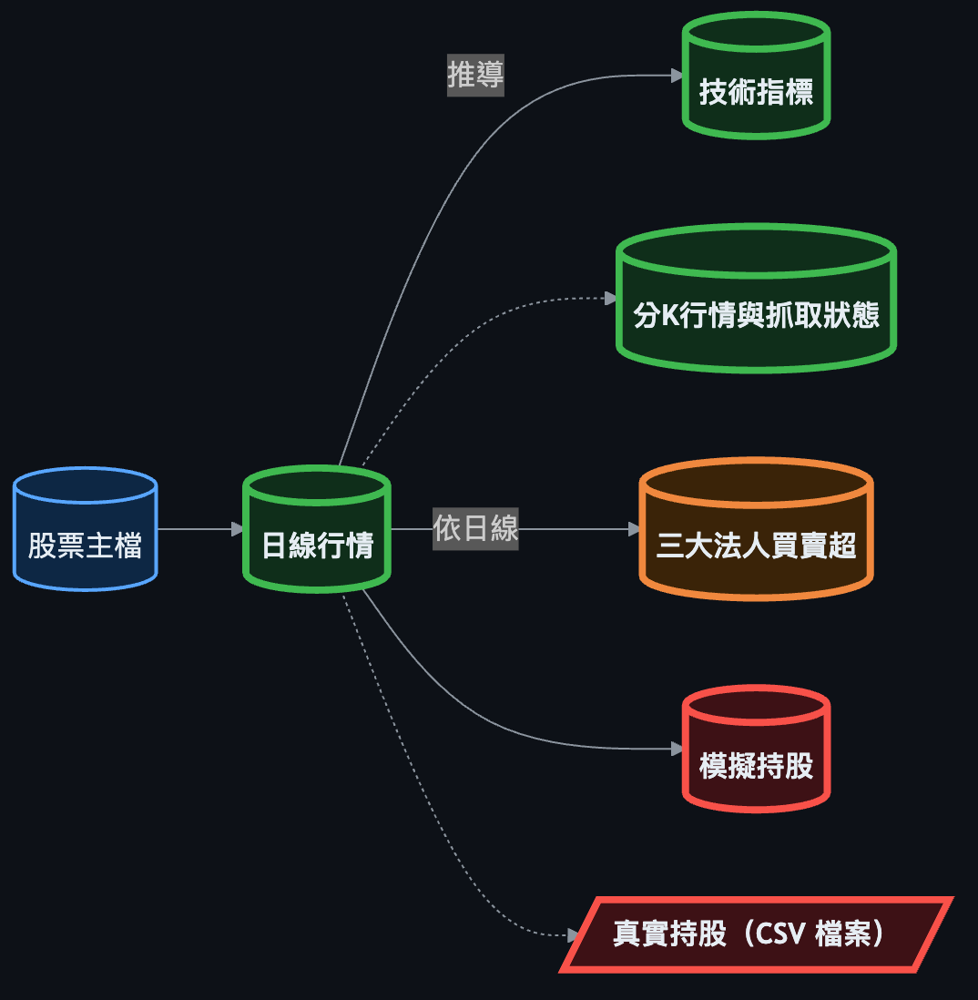

*（節錄自完整架構圖）*

日線行情是全系統唯一的行情入口。指標、掃描、產業排行、回測與兩本持股都只讀它，沒有第二個模組另外對外抓日線。

三條抓取路徑共用同一套進度追蹤、速率控制與重試：

- **每日增量**：收盤後一次取得全市場當日行情。
- **全市場回補**：主路徑是交易所逐日報表，成本以日曆天數計，不是以檔數計。
- **指名多檔回補**：逐檔查詢，Yahoo 為主、FinMind 備援。

系統啟動時會自動以「補到今日」的方式接續回補。

價格一律是未還原的原始成交價。停牌日不補零、不寫列；來源寫成 0 的列代表「該日無成交」，下游一律不當成行情。交易所口徑的成交量最準，Yahoo 偏低約一成多，所以每一列都記錄實際來源。

任何成功寫入行情的路徑（含每日增量）都必須推進該股票的進度，同類作業同時只能跑一批。

逐檔來源有兩層保護：任一來源被封鎖就改問下一個，且封鎖**不消耗**該檔的重試次數。

詳細欄位、規則與 API 定義 → [docs/backend/stock-price-ingestion.md](../backend/stock-price-ingestion.md)

### 3.3 技術指標（`stock_daily_indicator`）

*（節錄自完整架構圖）*

技術指標是由日線推導出的 MACD（12／26／9）與 KD（9／3／3，台股慣例），預先算好落地，供兩個月統計直接讀取。它與日線是單向推導：行情寫入後指標不會自動出現，必須觸發重算。

重算每檔要先判斷用全量重建還是增量推進：該檔完全沒有指標列時用全量，已有時用增量。這是正確性要求，因為增量遇到缺口時不得從初始值起算，只能標記為需要全量重建。

為了讓遞迴值收斂，運算會往前多取 250 個交易日暖身，暖身段不對外呈現；歷史不足 250 日的股票照常回應，但標示暖身不足。

統計查詢以日線為主表、指標為外連接，所以「行情已有、指標還沒算」時 K 棒仍在，指標欄位為空（空白表示「還沒算」，不等於 0 次交叉）。

詳細欄位、規則與 API 定義 → [docs/backend/stock-indicator-statistics.md](../backend/stock-indicator-statistics.md)

### 3.4 分K行情與抓取狀態（`stock_minute_price` / `stock_minute_fetch_status`）

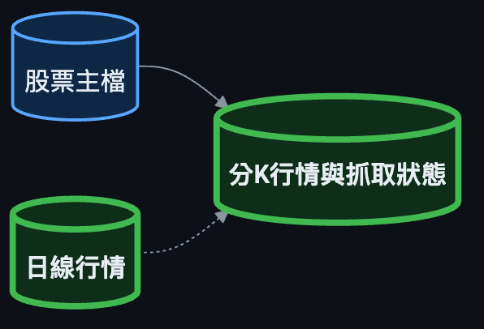

*（節錄自完整架構圖）*

分K與日線的策略刻意相反：**使用者點開某檔某一天才抓，抓過就永久快取**，而不是排程全抓。抓取狀態是它的快取判斷依據，記錄每個「股票 × 日期」目前是已有資料、查無資料、超出範圍、非交易日還是抓取失敗。

依日期分流到兩個互不備援的來源：近 30 天用 Yahoo，更早且不早於「最早可取得日」（設定值，預設 2023-05-23）的用富果 Fugle。早於最早可取得日的日期不發任何請求，直接回報「超出範圍」。

兩個來源寫入前都正規化到同一條時間格線（09:00–13:30，13:25–13:29 無K棒，共 266 根）。富果的成交量單位是張，寫入前乘以 1000 換成股，與日線口徑一致。

沒有富果金鑰時，30 天以前的日期不發請求、也不寫抓取狀態，免得設定好金鑰後被重試上限擋住。取不到分K是預期常態，一律以「狀態」表達而不是錯誤，且只要該日是交易日就仍附日線摘要。

詳細欄位、規則與 API 定義 → [docs/backend/stock-minute-price.md](../backend/stock-minute-price.md)

### 3.5 三大法人買賣超（`stock_institutional_trade`）

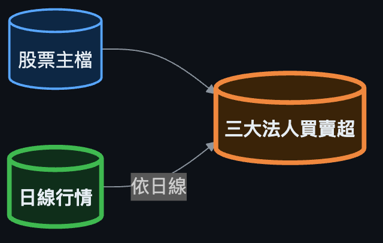

*（節錄自完整架構圖）*

三大法人買賣超記錄逐交易日、逐檔的外資與投信買賣超股數（單位為股），供三個法人籌碼型態使用。它**沒有自己的對外入口，也沒有進度表**，完全是日線作業的附屬步驟。

每次日線回補結束、或每日增量成功之後，系統在背景算出「日線有、法人還沒有任何一列」的交易日，只補那幾天。「有列＝已抓」就是進度，所以不需要另一張進度表。

單日資料必須整批寫入或整批不寫，否則殘缺的日期會被誤判為已完成。只寫主檔已存在的代號，不會反向新增主檔。

交易所日報在收盤後才發布，所以最新一兩個交易日常常還沒有資料，下游以「資料涵蓋到哪一天」誠實標示。

詳細欄位、規則與 API 定義 → [docs/backend/institutional-trade-ingestion.md](../backend/institutional-trade-ingestion.md)

### 3.6 產業別（`industry` / `stock_industry`）

*（節錄自完整架構圖）*

產業別是交易所官方的分類（如「半導體業」），供動態分頁按產業分組。一檔股票可以屬於多個產業，所以股票與產業是多對多，中間的歸屬表在 §2 收成一條邊。

它與股票主檔由**同一個使用者動作**一起維護：按「更新股票清單」會同時更新名稱與產業別，避免出現「清單已更新、產業別還沒更新」的中間狀態。

兩個來源的失敗處理不對稱。主檔來源失敗，整次什麼都不寫；產業別來源失敗，主檔照常更新，只是完全跳過產業別，並在結果中如實回報產業別來源狀態。

寫入時，對本次來源有涵蓋到的股票，先刪舊歸屬再寫新歸屬。沒被來源涵蓋的股票（例如人工新增的）既有分類完全不動，不會被清空。交易所來源給的是兩位數字代碼，要先對照成中文名稱；查不到的數字代碼寧可忽略，也不寫出「24」這種數字產業名。官方分類沒有「AI」之類的主題分類。

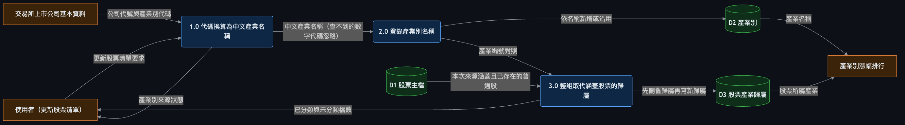

詳細欄位、規則與 API 定義 → [docs/backend/stock-universe-import.md](../backend/stock-universe-import.md)

### 3.7 模擬持股（`simulated_trade`）

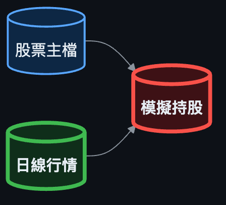

*（節錄自完整架構圖）*

模擬持股讓使用者用「代號＋（可省略的）買進日」記下一筆假設性的 1 張持股。買進價是該檔買進日的收盤價，股數固定 1,000 股，兩者都不接受指定。要換價格只能換日期，因為價格不是使用者填的數字，而是那天實際的收盤。

買進日若沒有該檔收盤價（假日、停牌），一律被拒絕，**不會自動改用鄰近交易日**。買進價寫入後即使來源事後更正收盤價也不變。同一檔同一天只能有一筆，重複會被拒絕。

未實現損益、報酬率與現價都在每次查詢時即時算出、不落地。賣出那一側假設「今天以最新收盤價賣掉」，並先扣手續費與證交稅；已下市的股票照常列出。總報酬率以成本加權，沒有任何持股時為「無值」而不是 0。

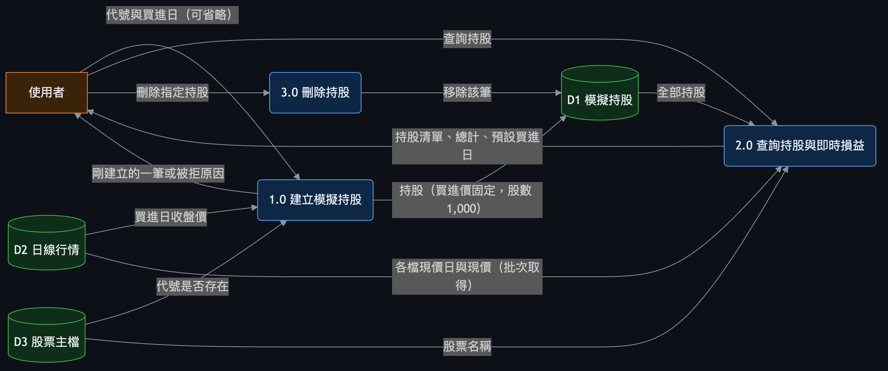

詳細欄位、規則與 API 定義 → [docs/backend/simulated-trade.md](../backend/simulated-trade.md)

### 3.8 真實持股（`data/real-trades.csv`，一份檔案而非資料表）

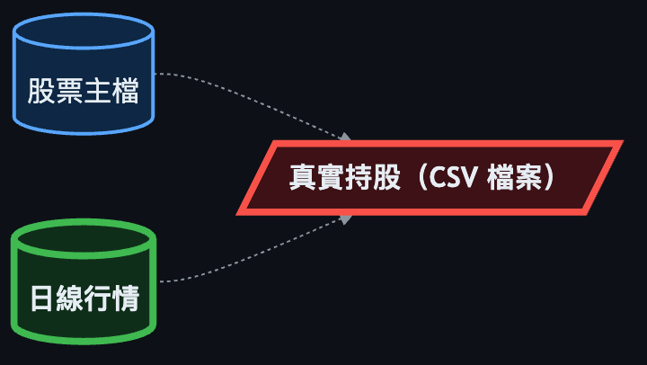

*（節錄自完整架構圖）*

真實持股記錄使用者**本人實際持有**的部位，與模擬持股在形狀上完全對稱：同樣的列表、新增、刪除，同樣即時算出現價與未實現損益。差別只有兩件事：

- **儲存位置**：它不是資料庫表，而是專案根目錄下一份隨程式碼版控的 CSV 檔（`data/real-trades.csv`），使用者可以直接手工編輯，或請助理讀券商對帳截圖代填。程式只負責讀這個檔、寫這個檔，沒有任何上傳或辨識圖片的入口。
- **買進價與股數由使用者指定**：四個欄位全部必填、沒有預設值，股數指的是股不是張。

它**沒有「同檔同日唯一」限制**：同一檔同一天分批成交是兩筆獨立部位，各自計算、不合併。

每一筆的編號就是它在檔案中的資料行位置，刪除後後面各筆會往前移，所以畫面每次新增或刪除後都要重新取得列表。格式錯誤的行逐行略過並回報檔案行號與原文，不讓整份清單失敗。只有欄位名列壞掉時才整個拒絕，且絕不改寫檔案。

寫回時是整檔改寫：註解、空白行與壞行都原樣留在原位，先寫暫存檔再整體換名，避免寫一半留下殘檔。查不到現價的持股仍會列出，成本照算，但不計入損益與報酬率。

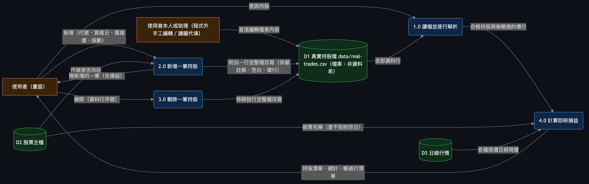

詳細欄位、規則與 API 定義 → [docs/backend/real-trade.md](../backend/real-trade.md)

## 4. 通用／可重用模組：同步進度追蹤（`stock_sync_progress`）

這是跨多種背景作業共用的進度表，以「作業種類」加「股票代號」為鍵。每一檔在每一種作業下各有一列，記錄狀態（待處理／執行中／完成／失敗／略過）、嘗試次數與最後同步到哪一天。目前使用它的有日線回補與指標重算兩種作業。

它的 contract 對「這是什麼作業」一無所知，也不認識股票的任何業務屬性：

- **何時標記完成、何時歸零嘗試次數、封鎖算不算失敗**，全部由寫入它的作業自己決定。
- **它只做三件事**：回答「這種作業現在跑到哪一檔」、支援從中斷處續傳，以及確保**同一種作業同時只有一批在跑**，重複啟動會被拒絕（409，已有作業執行中）。
- **哪些功能不使用它**：三大法人補齊刻意不使用，改以「該交易日是否已有資料」自我判斷；分K有自己的抓取狀態表；模擬／真實持股、回測、掃描與排行都不建任何進度列。

這個對比說明了它的適用邊界：只有需要斷點續傳、速率控制與重試上限、且要對外回報逐檔進度的長批次作業，才需要掛上它。

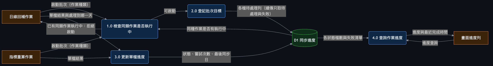

詳細欄位、規則與 API 定義 → [docs/backend/stock-price-ingestion.md](../backend/stock-price-ingestion.md)、[docs/backend/stock-indicator-statistics.md](../backend/stock-indicator-statistics.md)

## 5. End-to-End 情境走查

### 情境一：啟動後的自動補完鏈，以及它與手動同步的差別

系統啟動完成後有一條各自可獨立關閉的自動鏈：

1. **主檔同步**：先以交易所當日報表更新股票主檔，只新增或改名，不動在市旗標。
2. **日線補齊**：背景把在市普通股的日線補到今日，不阻塞啟動。主檔同步失敗不影響這一步。
3. **接力**：這一批行情作業真正結束之後，才接力觸發法人補齊與指標重算。

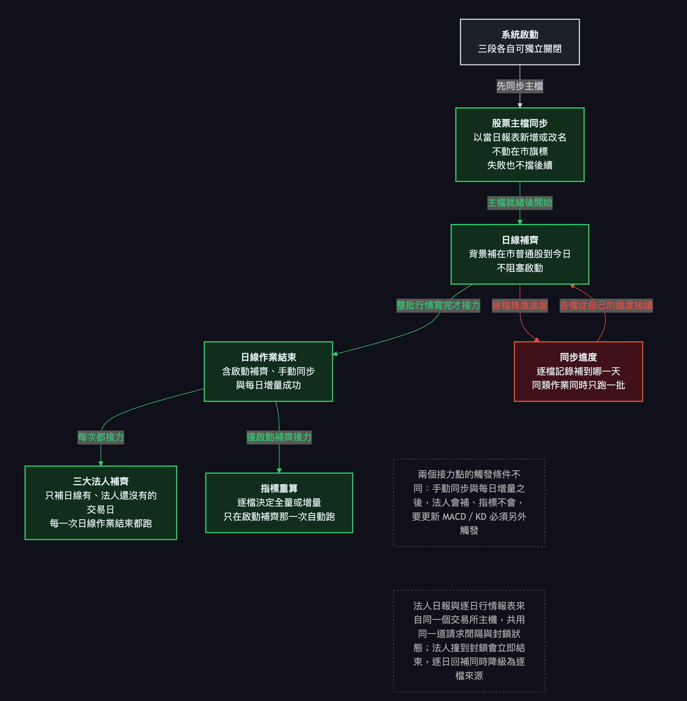

兩個接力點的觸發條件**不同**，很容易誤讀成同一件事：

- **法人補齊掛在每一次日線作業上**。不論是啟動補齊、手動按「同步日 K 至今日」，還是每日增量成功寫入，結束時都會在背景補一次；連「全部已是最新、沒發任何請求」與「部分標的失敗」都算結束。
- **自動重算指標只在啟動補齊那一次規定**。規格沒有規定手動同步或每日增量之後自動重算，要更新 MACD／KD 必須另外觸發。

這個順序是必要的：法人資料要先有當天日線才知道該補哪一天；指標要等整批行情寫完才開始，否則會在不完整的資料上算出之後還得重算的值。

另一個跨資料的連動是封鎖共用：法人日報與日線逐日報表來自同一個交易所主機，共用同一道請求間隔與封鎖狀態。法人補齊撞到封鎖會立即結束，逐日回補同時看到該主機不可用，並降級為逐檔來源繼續。

### 情境二：十一種型態各自的進場日規則，以及回測如何以進場日撮合

掃描目前有十一種型態：

- 五個價格型態：箱型突破、底底高、上漲支撐、反彈、累積上漲。
- 三個法人籌碼型態：法人買賣超佔比、法人連續買超、法人買超強度排名。
- 兩個技術指標型態：MACD 黃金交叉、KDJ 黃金交叉。
- 一個均線型態：站上均線（可複選 MA5／MA20／MA60，任一條達標即命中）。

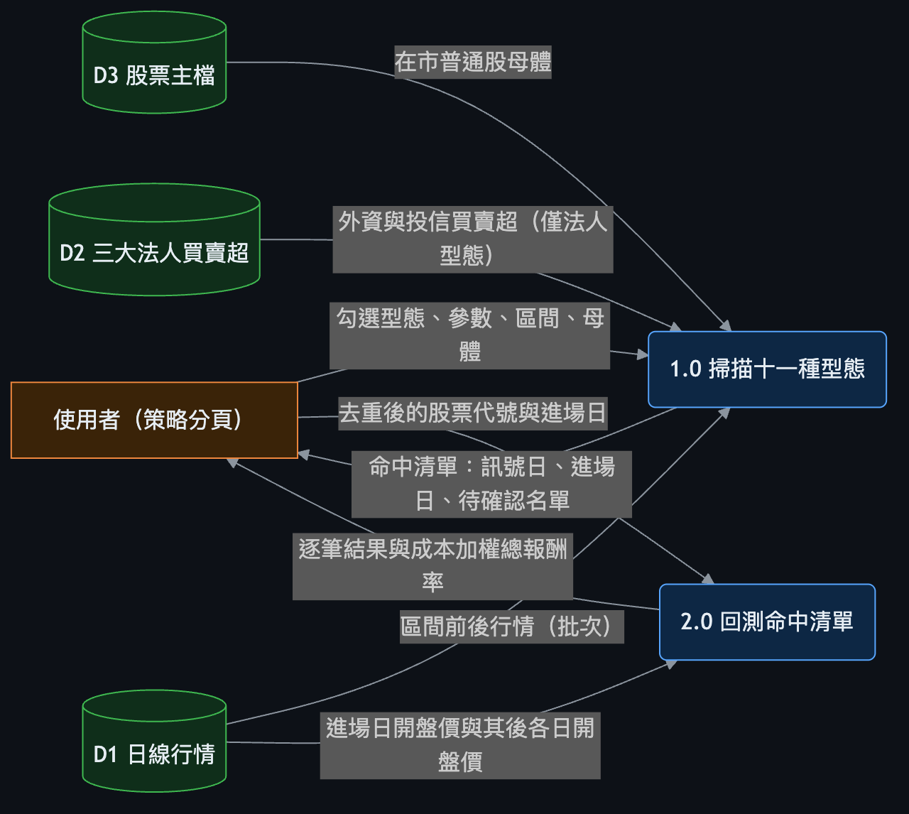

十一種型態共用**同一條**進場日規則：進場日＝**確認完成日之後的下一個交易日**。所有型態都用收盤價（或收盤後才發布的資料）判定，最早知道型態成立的時點是確認完成日的收盤，而那時已經無法成交，所以最早可成交的是下一個交易日的開盤。

| 型態 | 確認完成日 | 進場日 |
|---|---|---|
| 箱型突破、底底高、反彈、累積上漲 | 訊號日本身 | 訊號日之後的下一個交易日 |
| 上漲支撐 | 起漲日 D 之後守住的最後一天（D＋確認天數，可選 1 或 2，預設 2） | 再下一個交易日（預設為 D＋3） |
| 三個法人籌碼型態 | 訊號日（日報在收盤後才發布） | 訊號日之後的下一個交易日 |
| MACD 黃金交叉、KDJ 黃金交叉 | 訊號日（交叉要等收盤才確認） | 訊號日之後的下一個交易日 |
| 站上均線 | 訊號日（收盤站上均線） | 訊號日之後的下一個交易日 |

「下一個交易日」依該檔日線的相鄰資料列認定，停牌缺列不計，不以日曆日加一推算，所以可能晚於掃描區間的結束日。

由此產生**「待確認」**狀態：命中但確認完成日已是該檔最新一筆日線、還沒有下一個交易日可進場時，該檔不進命中清單，也不計入命中檔數，改列在待確認名單。同一檔若有較早、已有進場日的命中，就以那一次列入命中清單。這個規則十一個型態都適用，包括反彈與累積上漲。

**回測完全不認識任何型態**：它只收「股票代號＋進場日」，以進場日**開盤價**買進，賣在其後（從次一交易日起算到今日）**最高的開盤價**。這樣設計是為了不讓進場日規則在掃描與回測各寫一份而逐漸分歧。

回測有幾條不顯而易見的規則：

- **同一檔每個相異進場日是獨立一筆。** 各佔 1 張、各自計入彙總；同一進場日不得重複送出，重複會被拒絕，不會被默默合併。
- **無法回測的筆照常回報、不計入彙總。** 包括買進日之後還沒有交易日、買進日沒有該檔資料、買進日開盤價為 0 三種情形。
- **賣出價低於買進價時負值如實回報。**
- **總報酬率以成本加權，不是各檔平均。** 沒有任何可回測筆時為「無值」。

規格同時記錄了一個已知限制：箱型突破（嚴格、需連 2 根確認）與底底高的實際判定時點比訊號日更晚，它們的進場日因此仍偏早，回測會偏樂觀，不得描述為「完全沒有未來資訊」。

### 情境三：從「更新股票清單」到動態分頁的重複計算與「未分類」

使用者按「更新股票清單」時，主檔與產業別在同一個動作內更新。若產業別來源失敗，主檔仍成功，既有分類原封不動，並在結果中標出產業別未更新，同時回報「未分類檔數」，讓使用者在按下按鈕當下就知道動態分頁的未分類區塊為什麼大。

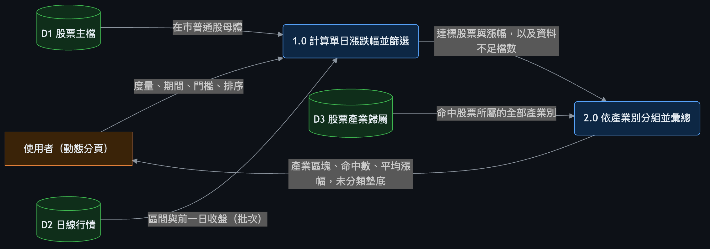

接著，產業別漲幅排行讀這份分類，有三個容易搞混的地方：

- **一檔股票可屬於多個產業，並在它所屬的每一個產業區塊各出現一次。** 所以各產業「命中檔數」加總會大於實際命中的股票數，回應同時給「各產業命中數」與「去重後總檔數」，兩者缺一不可。
- **命中但沒有任何產業歸屬的股票歸入固定的「未分類」區塊。** 這個區塊在任何排序下都墊底，因為它不是一個產業。
- **每個區塊的「平均漲幅」只以達標的那幾檔計算。** 它回答的是「這個產業有動的那幾檔動多大」，不代表整個產業的表現，也必然不低於門檻。

資料不足（含收盤價為 0）的股票計入「資料不足檔數」，不列入結果，也不當成未達門檻。

排行與型態掃描共同受一條用語約束：輸出只能是「統計／偵測結果」，不得包裝成買賣建議。

### 情境四：真實持股、模擬持股與回測：同一把尺，不同的帳

三者共用同一套交易成本口徑：手續費 0.1425%（買賣各一次，不打折、不設最低）、證交稅 0.3%（只在賣出時收），三項各自無條件捨去到整數元。差別在買賣假設與資料來源：

| | 回測 | 模擬持股 | 真實持股 |
|---|---|---|---|
| 買進價 | 進場日開盤價 | 買進日收盤價（系統填入） | 使用者指定的實際成交價 |
| 股數 | 固定 1,000 股 | 固定 1,000 股 | 使用者指定（股） |
| 賣出假設 | 買進日之後最高開盤價 | 假設今天以最新收盤價賣出 | 假設今天以最新收盤價賣出 |
| 儲存位置 | 不落地 | 資料庫表 | 版控 CSV 檔 |

模擬與真實共用同一份損益算法，同一組（買進價、股數、現價）算出的成本、損益與報酬率逐位相同。

兩本持股有三個容易誤解的差別：

- **同檔同日是否唯一。** 模擬持股的買進價由系統從收盤價推出，同檔同日必然重複，所以只允許一筆；真實持股的價格由使用者給，同檔同日分批成交是兩筆獨立部位，各自計算、不合併。
- **買進日是否需要有行情。** 模擬持股要求買進日必須有收盤價；真實持股不要求，所以真實持股可能出現「查不到現價」的列，成本照算，但不計入損益與報酬率的分母。
- **編號是否穩定。** 真實持股的編號是檔案中的資料行位置，刪除後其餘各筆往前移，只在「查詢 → 刪除」的一次來回內穩定；模擬持股的編號是資料庫自增值，不受刪除影響。

### 情境五：「下市」不是刪除，各處怎麼對待它

股票被人工下市（在市旗標為否）後，各處行為並不一致，但都有明確理由：

- **退出母體**：股票清單預設不列、全市場回補不再推進、型態掃描與產業排行的全市場母體不含它。
- **歷史保留**：已寫入的歷史行情與指標完全不動。
- **仍可被指名使用**：指名掃描與回測允許已下市股票；模擬與真實持股照常列出，現價取它最後一個有成交日的收盤，並逐筆標示現價日。
- **不被自動覆寫**：批次匯入既不會把它改回在市，也不會因為它沒出現在當日報表就把停牌股標成下市。下市與復市只由人工處理。

## 6. 延伸閱讀

| 章節 | 對應 backend 詳細文件 |
|---|---|
| 3.1 股票主檔 | [stock-catalog](../backend/stock-catalog.md)、[stock-universe-import](../backend/stock-universe-import.md)、[stock-price-ingestion](../backend/stock-price-ingestion.md) |
| 3.2 日線行情 | [stock-price-ingestion](../backend/stock-price-ingestion.md) |
| 3.3 技術指標 | [stock-indicator-statistics](../backend/stock-indicator-statistics.md) |
| 3.4 分K行情與抓取狀態 | [stock-minute-price](../backend/stock-minute-price.md) |
| 3.5 三大法人買賣超 | [institutional-trade-ingestion](../backend/institutional-trade-ingestion.md) |
| 3.6 產業別 | [stock-universe-import](../backend/stock-universe-import.md) |
| 3.7 模擬持股 | [simulated-trade](../backend/simulated-trade.md) |
| 3.8 真實持股 | [real-trade](../backend/real-trade.md) |
| §4 同步進度追蹤 | [stock-price-ingestion](../backend/stock-price-ingestion.md)、[stock-indicator-statistics](../backend/stock-indicator-statistics.md) |
| §5 情境一 | [stock-price-ingestion](../backend/stock-price-ingestion.md)、[stock-indicator-statistics](../backend/stock-indicator-statistics.md)、[institutional-trade-ingestion](../backend/institutional-trade-ingestion.md) |
| §5 情境二 | [strategy-scan](../backend/strategy-scan.md)、[strategy-backtest](../backend/strategy-backtest.md) |
| §5 情境三 | [stock-universe-import](../backend/stock-universe-import.md)、[industry-gain-ranking](../backend/industry-gain-ranking.md) |
| §5 情境四 | [real-trade](../backend/real-trade.md)、[simulated-trade](../backend/simulated-trade.md)、[strategy-backtest](../backend/strategy-backtest.md) |
| §5 情境五 | [stock-catalog](../backend/stock-catalog.md)、[stock-universe-import](../backend/stock-universe-import.md)、[stock-price-ingestion](../backend/stock-price-ingestion.md)、[strategy-scan](../backend/strategy-scan.md)、[simulated-trade](../backend/simulated-trade.md) |
