# 股票系統整合藍圖

## 1. 標題與目的

**股票分析系統 — 資料層與策略層整合藍圖**

本文件整合以下十份後端 spec，把它們的資料儲存與業務流程疊成同一份系統圖，而不是逐份摘要各自的內容：

- `specs/backend/stock-price-ingestion.md`（日線行情抓取與回補）
- `specs/backend/stock-catalog.md`（股票清單查詢與人工維護）
- `specs/backend/stock-universe-import.md`（上市股票與產業別批次匯入）
- `specs/backend/stock-indicator-statistics.md`（MACD／KD 指標運算與統計）
- `specs/backend/stock-minute-price.md`（分K隨選抓取）
- `specs/backend/institutional-trade-ingestion.md`（三大法人買賣超抓取）
- `specs/backend/industry-gain-ranking.md`（產業別漲幅排行）
- `specs/backend/strategy-scan.md`（策略型態掃描，十個型態）
- `specs/backend/strategy-backtest.md`（策略命中回測）
- `specs/backend/simulated-trade.md`（模擬交易持股）

整合後的系統現在的樣子是：**一張以「股票」為中心的行情資料網**（日線、指標、分K、法人籌碼、產業別分類），外加**三個只讀、不落地的分析模組**（型態掃描、回測、產業別漲幅排行）在這張網上即時運算，再加**一個使用者自建的模擬持股帳本**與整張網共用同一套收盤價與交易成本模型。所有抓取路徑最終都匯入同一批資料表；所有分析模組都不擁有自己的資料，只是換個角度讀同一份行情。

## 2. 全景關係圖

這張圖只回答一個問題：這個系統由哪幾份資料組成、誰接著誰。型態掃描、回測、產業別排行三個分析模組**沒有自己的資料表**，因此不出現在這張圖上——它們的角色留到 §5 情境走查說明。

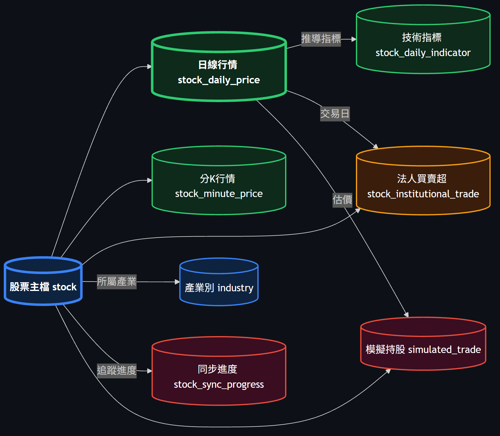

**圖中顏色群組**：藍色為「主檔／分類」（股票主檔、產業別）；綠色為「行情與指標」（日線、指標、分K），也是系統其餘一切的資料源頭；橘色為「法人籌碼」；紅色為「操作性／使用者自建資料」（同步進度、模擬持股）。股票主檔與日線行情以粗框標示為兩個核心 entity——系統裡幾乎每一份資料最終都指向其中之一。

## 3. 每個 entity / data store

### 3.1 股票主檔（`stock`）

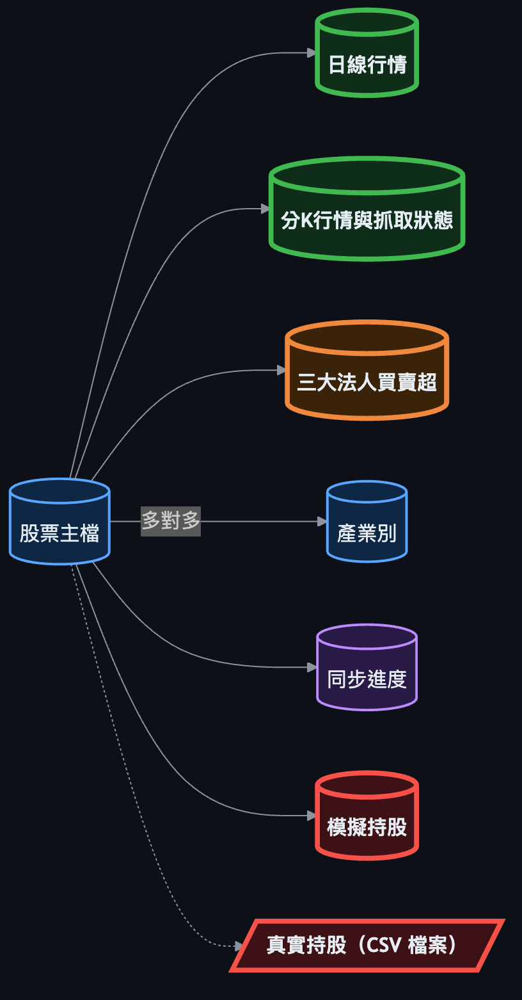

*（節錄自完整架構圖）*

股票主檔是全系統的身分證字號表：代號、名稱、市場別、是否在市。它有兩個彼此獨立的寫入來源——**批次匯入**（使用者按「更新股票清單」，一次帶入全市場代號、名稱與產業別）與**每日增量**（以交易所當日全市場快照順帶維護，只在新股票或名稱有異動時才寫入；系統啟動時的主檔同步走的也是這一條）；而「是否在市」（`is_active`）**只由人工的新增／修改／下市三個端點改變**，兩條自動路徑永遠不會把一檔股票標記下市或復活，避免「今天剛好停牌」被誤判成下市。下市為軟刪除，歷史行情永遠保留。

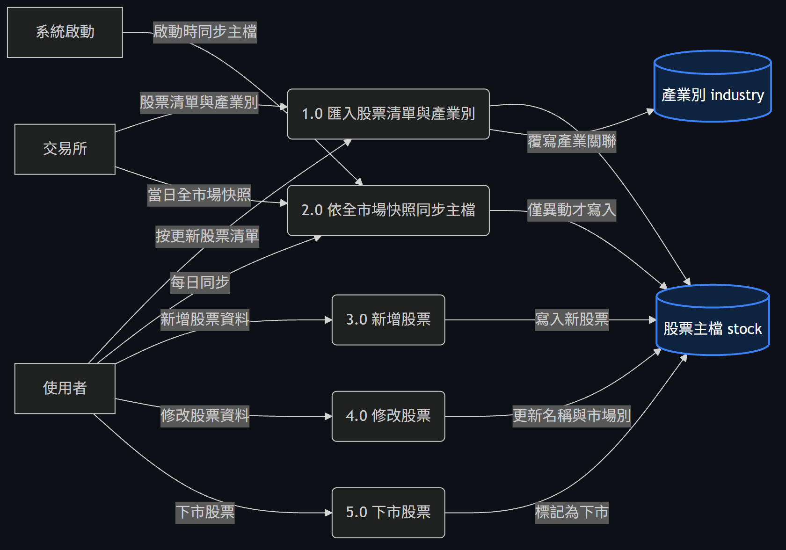

詳細欄位、規則與 API 定義 → docs/backend/stock-catalog.md、docs/backend/stock-universe-import.md、docs/backend/stock-price-ingestion.md

### 3.2 日線行情（`stock_daily_price`）

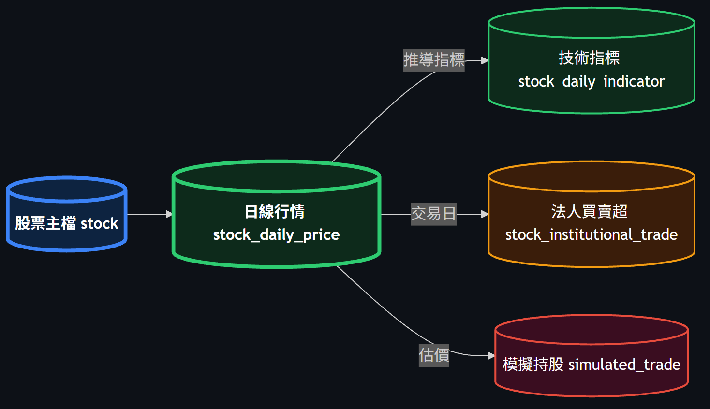

*（節錄自完整架構圖）*

這是全系統唯一的行情入口——指標運算、型態掃描、產業別排行、回測、模擬持股全部只讀這張表，沒有第二個模組會另外對外抓行情。它有三條抓取路徑（每日增量、全市場逐日回補、指定多檔逐檔回補），共用同一套斷點續傳與速率控制；全市場回補的主路徑是交易所逐日快照（成本以「交易日數」計，而非「檔數」），只有在快照來源被封鎖時才降級為逐檔查詢，逐檔查詢本身又有 Yahoo 主／FinMind 備援兩層來源切換。價格一律為未經除權息還原的原始成交價，停牌日不補零、不寫入任何列。

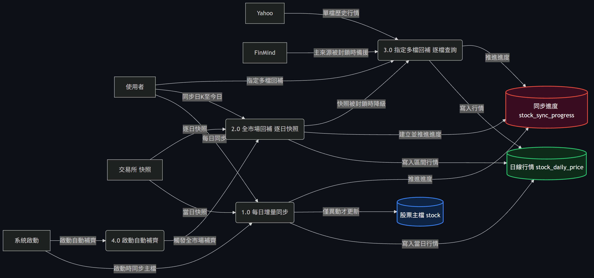

詳細欄位、規則與 API 定義 → docs/backend/stock-price-ingestion.md

### 3.3 技術指標（`stock_daily_indicator`）

*（節錄自完整架構圖）*

由日線 OHLC 遞迴推導出的 MACD 與 KD，固定參數（`MACD_12_26_9__KD_9_3_3`），供兩個月統計 API 直接讀取。它與日線行情之間是**單向的推導關係**：行情寫入後不會自動有指標，必須觸發重算；而**自動重算只掛在系統啟動的行情補齊上**——手動的「同步日 K 至今日」與每日增量都不會連帶重算指標，那之後要更新 MACD／KD 必須另外觸發（見 §5 情境一）。重算時逐檔判斷該用全量重建（該檔完全沒有指標列時）還是增量推進（已有指標列時）——這條判斷本身就是正確性要求，不是效能選項，因為增量推進在找不到前一日狀態時無法安全地從初始值起算。

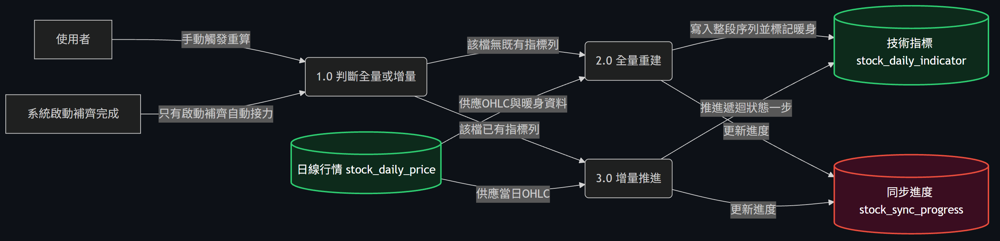

詳細欄位、規則與 API 定義 → docs/backend/stock-indicator-statistics.md

### 3.4 分K行情與抓取狀態（`stock_minute_price` / `stock_minute_fetch_status`）

*（節錄自完整架構圖）*

與日線的「排程主動全抓」策略刻意相反：分K是**使用者點開某一天才抓，抓過即永久快取**。依日期分流到兩個互不備援的來源——近 30 天用 Yahoo、更早的用富果 Fugle（只到 2023-05-23 為止），兩者都寫入同一張表、正規化到同一條時間格線（09:00–13:30、13:25–13:29 無資料）。抓取狀態表是本模組的快取判斷依據：已有資料且非當日直接讀庫、當日盤中資料則有 14:00 前後兩種行為、`OUT_OF_WINDOW` 這類結論會隨 `availableFrom` 設定值重新檢驗而自我修正。

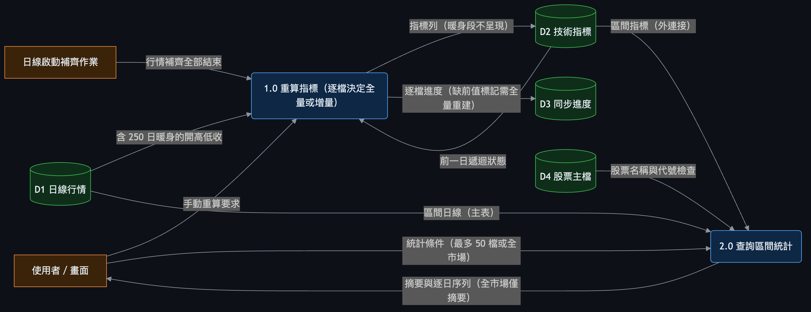

詳細欄位、規則與 API 定義 → docs/backend/stock-minute-price.md

### 3.5 三大法人買賣超（`stock_institutional_trade`）

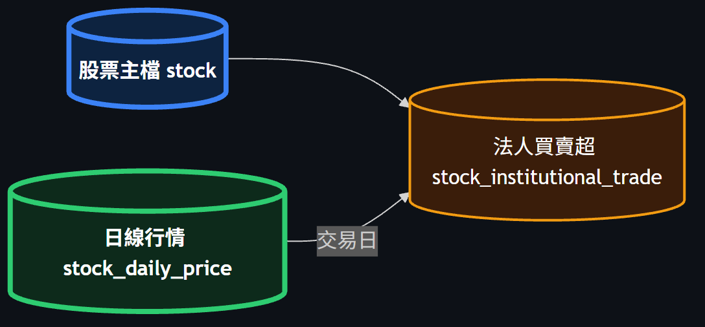

*（節錄自完整架構圖）*

供三個法人籌碼型態使用的外資／投信買賣超股數，逐交易日、逐檔寫入，單位為股。它**沒有自己的端點也沒有進度表**——完全是日線抓取的附屬品：每一次全市場回補結束、或每一次每日增量成功後，都會在背景比對「日線有的交易日」與「法人資料已有的交易日」的差集，只抓缺的那幾天。這個差集判斷本身就是進度追蹤，不需要另一張表。只有主檔中已存在的代號才會被寫入，不會反向新增主檔列。

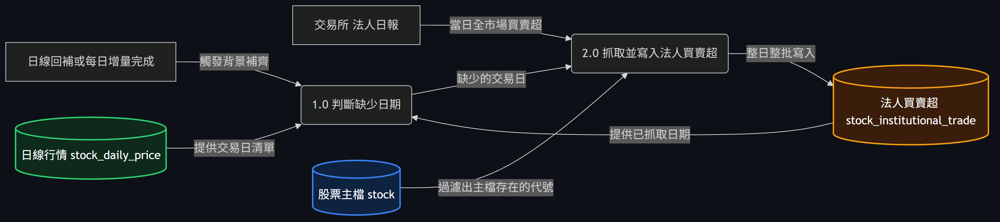

詳細欄位、規則與 API 定義 → docs/backend/institutional-trade-ingestion.md

### 3.6 產業別（`industry` / `stock_industry`）

*（節錄自完整架構圖）*

交易所官方的產業分類（如「半導體業」），供動態分頁按產業分組使用。它與股票主檔在**同一支批次匯入 API、同一個交易邊界**內一起維護，因為「這檔股票叫什麼」與「這檔股票屬於哪個產業」是使用者同一個操作（按「更新股票清單」）要的兩個結果，分成兩支 API 只會製造「清單已更新、產業別還沒更新」的中間狀態。每次匯入對本次來源涵蓋到的股票採**整組取代**（先刪後寫），但對來源未涵蓋到的股票（例如人工新增的標的）**完全不動其既有分類**——這是全量重建與局部更新之間的關鍵折衷。

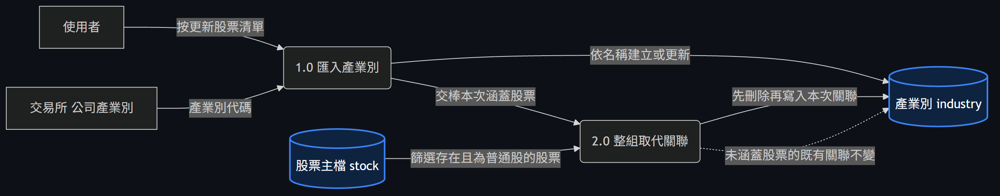

詳細欄位、規則與 API 定義 → docs/backend/stock-universe-import.md

### 3.7 模擬持股（`simulated_trade`）

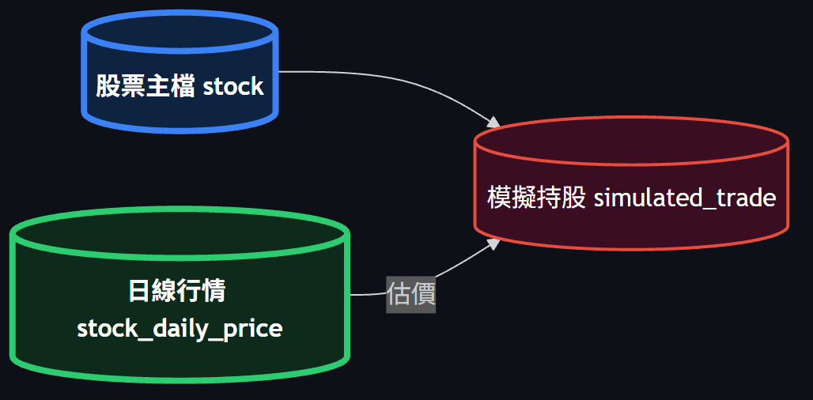

*（節錄自完整架構圖）*

讓使用者用「代號＋（選填的）買進日」記下一筆假設性的 1 張持股，未實現損益與報酬率**每次查詢當下即時算出、不落地**——只有買進日與買進價在建立當下寫死、事後不因行情被更正而變動。買進日可以指定，省略時取「今日以前最後一個有收盤價的交易日」；但買進價與股數一律不接受指定，價格永遠是那一天實際的收盤價，要換價格只能換日期。它是單一資料表的標準建立／查詢／刪除，唯一的跨 entity 之處是讀取股票主檔取得名稱、讀取日線行情取得買進價與現價，並且與回測共用同一套「手續費 0.1425%、證交稅 0.3%、三項各自捨去至元」的交易成本模型——差別只在出場假設不同（回測用區間內最高開盤價，本模組用最新收盤價假設今天賣掉）。因為沒有第二個 entity 因它而改變狀態，這裡不另畫詳細圖。

詳細欄位、規則與 API 定義 → docs/backend/simulated-trade.md

## 4. 通用／可重用模組：同步進度追蹤（`stock_sync_progress`）

這是一張跨多種背景作業共用的進度表，以 `job_type`（`PRICE_BACKFILL`、`INDICATOR_REBUILD`）與 `stock_id` 為複合鍵，記錄每一檔在每一種作業下的狀態（待處理／執行中／完成／失敗／略過）、嘗試次數與最後同步到哪一天。它的 contract 設計對「這是什麼作業」一無所知——寫入它的服務自己決定何時把一檔標記完成、何時歸零重試次數；它只負責回答「這個 job_type 現在跑到哪裡」與提供同一 `job_type` 同時只能有一批作業執行的併發鎖。三大法人籌碼的抓取刻意選擇**不使用**這張表（改以「該交易日是否已有任何一列」自我判斷），這個對比恰好說明了它的邊界：只有需要斷點續傳、需要速率控制與重試上限、需要對外回報逐檔進度的長批次作業，才需要掛上它。

## 5. End-to-End 情境走查

### 情境一：系統啟動後的自動補完鏈，以及它與手動同步的差別

系統啟動完成後有一條各自可獨立關閉的自動鏈：先以交易所當日全市場快照同步股票主檔（只新增或改名，不動 `is_active`），接著把在市普通股的日線補到今日，**這一批行情作業真正結束之後**（不是同時），才自動接力觸發一次全市場指標重算，且逐檔判斷要全量重建還是增量推進。

這條鏈揭露的非顯而易見規則是**兩個接力點的觸發條件並不相同**，很容易被誤讀成同一件事：

- **三大法人買賣超的補齊掛在「每一次」日線作業上**——不論它是啟動補齊、策略分頁按下的「同步日 K 至今日」、還是每日增量成功寫入，結束時都會在背景補齊一次（連「全部標的已是最新、沒發出任何外部請求」與「部分標的失敗」都算結束）。
- **指標重算只掛在「系統啟動」的那一次行情補齊上**。手動按「同步日 K 至今日」或呼叫每日增量之後，MACD／KD **不會**自動跟著更新，要更新必須另外觸發重算。

順序本身也是必要的：法人資料要先有當天的日線才知道「哪一天該補」；指標重算則必須等整批行情寫完才開始，否則會在不完整的資料上算出之後還要再重算一次的指標。

### 情境二：十種型態各自的進場日規則，以及回測如何以進場日撮合

型態掃描的十個型態對「今天算出訊號、哪一天才能真的買進」給出三種不同答案，這是使用者最容易誤解的地方：

| 型態分類 | `buyDate`（進場日） | 為什麼 |
|---|---|---|
| 箱型突破、底底高、反彈、累積上漲 | 等於訊號日本身 | 這四個型態全部以**收盤價**判定，訊號日收盤的當下就已經知道型態成立，用該日收盤買進不含未來資訊 |
| 上漲支撐 | 訊號日之後第 2 個交易日（D+2） | 這個型態要等 D+1、D+2 都守住起漲收盤才確認成立，在 D 收盤當下根本不知道會不會成立——用 D 收盤買，等於用了兩天後才會有的資訊 |
| 三個法人籌碼型態 | 訊號日之後的下一個交易日 | **看資料公布時間**：三大法人買賣超日報是**收盤後**才由交易所發布，訊號日收盤時根本看不到當天的法人進出，用該日收盤買進等於用了收盤後才公布的資料 |
| MACD 黃金交叉、KDJ 黃金交叉 | 訊號日之後的下一個交易日 | **不是**未來資訊問題——交叉由收盤價推導，訊號日收盤買進本身並不使用任何未來資料；延後一天單純是因為交叉要等收盤才確認，而那個時間點已經無法再下單成交，最早能實際買進的時點就是下一個交易日 |

這張表的最後兩列容易被誤讀成同一件事，但規格書刻意把理由分開寫清楚：法人籌碼型態的延後是**修正看到未來資料的錯誤**；技術指標型態的延後是**反映現實中最早能成交的時間點**，兩者延後的天數剛好相同，但性質不同。「下一個交易日」一律以日線資料列的相鄰關係認定，遇到停牌缺列不計，也**不以日曆日推算**，因此可能晚於掃描區間的結束日。

由此衍生出「待確認」（`pendingConfirm`）狀態：當某檔命中訊號、但訊號日之後**還沒有下一個交易日的資料**（也就是訊號日剛好是該檔最新一筆日線）時，這筆命中不會出現在命中清單、也不計入命中檔數，而是單獨列在待確認清單裡，等下一個交易日的資料出現才會轉正。同一檔若另有一次較早、已經有進場日的命中，就以那一次列入命中清單，不再列入待確認。會產生待確認的型態有：箱型突破（確認根數為 2 且確認日尚未到）、上漲支撐（D+1／D+2 尚未到齊）、三個法人籌碼型態，以及 MACD／KDJ 兩個技術指標型態——**後兩個技術指標型態會產生待確認，是本次進場日改動帶來的新行為**，它們原本恆為空。反彈與累積上漲則**恆為空**，因為它們採「已達標就命中、不等窗口跑滿」。

箱型突破另有一個與靈敏度**正交**的開關 `requireVolume`（預設開啟）：關閉後只是跳過「當日成交量須放大到近 5 日均量倍數以上」這一步判定，其餘箱體、盤整前提、突破幅度、確認根數的判定完全不受影響，倍數本身也不會被指定——它是一個獨立的過濾條件，不是第四段靈敏度。

**回測端點完全不理解任何型態**：它只接受掃描回報的「股票代號＋進場日」，以進場日收盤價買進、其後至今日的最高開盤價賣出，對「這個進場日是哪個型態、哪個訊號日算出來的」一無所知。這個設計邊界正是為了不讓進場日規則被兩份程式碼各寫一次而漸行漸遠——上漲支撐的訊號日（起漲日 D）與買進日（D+2）刻意不同，若回測自己重新推算，就等於在掃描之外重新定義一次「何時可以買」。

### 情境三：產業別漲幅排行的重複計算與「未分類」

一檔股票可能同時屬於多個產業別（例如集團股跨足不同主業），漲幅排行的規則是「在它所屬的**每一個**產業別區塊都各出現一次」。這造成一個容易搞混的地方：各產業別「命中檔數」加總起來，會**大於**實際命中的相異股票數，因此回應同時提供未去重的各產業命中數與一個去重後的總命中檔數，兩者缺一不可、不能互相取代。命中但完全沒有產業別關聯的股票不會被丟棄，而是歸入固定的「未分類」區塊，且這個區塊在任何排序方式下永遠排在最後——因為它本質上不是一個產業，把它排進「哪個產業漲最多」的比較沒有意義。每個產業區塊另外回報的「平均漲幅」，母體只算該區塊裡達標的那幾檔，不代表這個產業整體的表現。這與型態掃描共同受同一條用語約束：兩者的輸出都只能是「偵測／統計結果」，不得包裝成買賣建議。

## 6. 延伸閱讀

| 章節 | 對應 backend 詳細文件 |
|---|---|
| 3.1 股票主檔 | docs/backend/stock-catalog.md、docs/backend/stock-universe-import.md、docs/backend/stock-price-ingestion.md |
| 3.2 日線行情 | docs/backend/stock-price-ingestion.md |
| 3.3 技術指標 | docs/backend/stock-indicator-statistics.md |
| 3.4 分K行情與抓取狀態 | docs/backend/stock-minute-price.md |
| 3.5 三大法人買賣超 | docs/backend/institutional-trade-ingestion.md |
| 3.6 產業別 | docs/backend/stock-universe-import.md |
| 3.7 模擬持股 | docs/backend/simulated-trade.md |
| §4 同步進度追蹤 | docs/backend/stock-price-ingestion.md（`PRICE_BACKFILL` 語意）、docs/backend/stock-indicator-statistics.md（`INDICATOR_REBUILD` 語意） |
| §5 情境一 | docs/backend/stock-price-ingestion.md、docs/backend/stock-indicator-statistics.md、docs/backend/institutional-trade-ingestion.md |
| §5 情境二 | docs/backend/strategy-scan.md、docs/backend/strategy-backtest.md |
| §5 情境三 | docs/backend/industry-gain-ranking.md |
