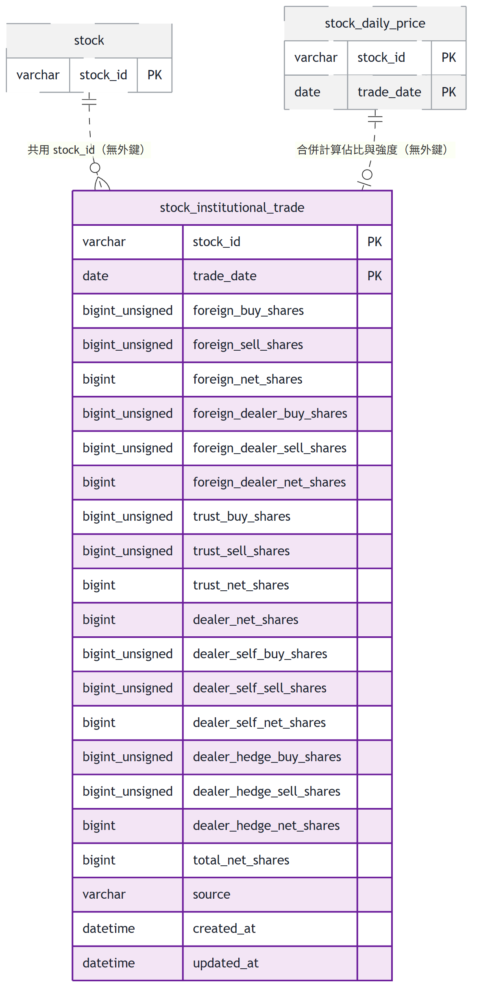

# 股票資料庫 ER 模型總覽

本資料庫涵蓋台股全市場股票的主檔字典、日線與分鐘級行情、技術指標、三大法人買賣超、批次作業進度，以及 migration 執行紀錄，是股票統計、K 線瀏覽與選股策略功能共用的資料基礎。整個 schema 依業務性質切分為六個叢集：主檔管理（股票／產業別字典）、日線行情與指標、三大法人買賣超、分鐘 K 線、批次同步進度、Migration 執行紀錄；除「主檔管理」內部的 `stock_industry` 關聯表外，各叢集的事實表與主檔管理之間刻意**不建外鍵**，一律以共用的 `stock_id` 鍵對應，理由是行情類資料的寫入健壯性優先於參照完整性。

## 全景

## master — 主檔管理

此叢集是全系統的股票與產業別字典，其他叢集的事實表都以 `stock_id` 這把共用鍵指向本叢集，但刻意不建外鍵以避免新股寫入失敗。

- **stock**：全市場股票主檔，記錄代號、名稱、市場別與是否仍在交易，作為回補排程 universe 與統計結果名稱來源；與 `stock_daily_price` 等行情事實表之間刻意不建外鍵，理由是新上市股票可能先出現在行情快照才補進主檔，外鍵會讓行情寫入失敗而遺失無法重取的資料。
- **industry**：產業別字典表，由產業別匯入以名稱 UPSERT 補齊、不預先種入資料，且本表不做刪除以保持代理主鍵穩定，避免既有 `stock_industry` 關聯指向錯誤產業。
- **stock_industry**：`stock` 與 `industry` 的多對多關聯表，是本 schema 唯一宣告外鍵的表（`fk_si_stock`、`fk_si_industry`，皆 `ON UPDATE/DELETE CASCADE`）；`ON DELETE CASCADE` 在現行系統不會被觸發，因為下市一律走 `is_active = 0`、`stock` 列從不刪除，外鍵存在只是為未來真的發生刪除時不留下孤兒列的保險。

## daily-price — 日線行情與指標

此叢集儲存日線 OHLC 原始行情與由其推導的 MACD／KD 指標，是統計與策略功能的核心事實資料。

- **stock_daily_price**：個股每交易日的 OHLC、成交量與成交金額，原始成交價（未除權息還原），是所有技術指標的唯一資料來源，其成交量也是法人籌碼型態佔比與強度的分母；與 `stock` 之間不建外鍵（理由同主檔管理叢集）。
- **stock_daily_indicator**：由 `stock_daily_price` 的 OHLC 推導的 MACD（`dif`/`dea`/`osc`）與 KD（`k_value`/`d_value`/`j_value`）指標，連同遞迴中間狀態（`ema_fast`/`ema_slow`）一併落地以支援逐日增量推進；主鍵含 `param_key` 以支援多組參數並存，與 `stock_daily_price` 之間未宣告外鍵，僅以 `(stock_id, trade_date)` 共用鍵對應。

## institutional-trade — 三大法人買賣超

此叢集儲存三大法人逐日買賣超日報，與日線行情的成交量合併計算法人買賣超佔比與強度。

- **stock_institutional_trade**：三大法人（外資不含外資自營商、外資自營商、投信、自營商合計／自行買賣／避險）逐日買進／賣出／買賣超股數，共十七個數值欄位依資料源原樣保存、不做任何加總或合併，單位為股；不建任何外鍵——與 `stock` 僅共用 `stock_id` 鍵，與 `stock_daily_price` 則是策略掃描依 `(stock_id, trade_date)` 把買賣超股數與成交量合併相除計算佔比與強度時的邏輯關聯，非資料庫層級約束。資料源只列出有法人交易的證券，因此不寫補零列。

## minute-price — 分鐘 K 線

此叢集儲存個股單日分鐘級 K 線與其逐日抓取狀態，供前端點選日 K 後展示當日分 K，並避免對無資料日期重複外部請求。

- **stock_minute_price**：個股單一交易日 09:00–13:30 的每分鐘 OHLCV，僅存 1 分鐘 K 棒（5/15/30/60 分由查詢時聚合，不落地），以年度 `RANGE` 分區支援整段捨棄；分區表不支援外鍵，且沿用主檔管理叢集「不對行情表建外鍵」的決定。
- **stock_minute_fetch_status**：記錄每個「股票 × 交易日」分 K 的抓取結果（`AVAILABLE`／`NO_DATA`／`OUT_OF_WINDOW`／`FAILED`／`NOT_A_TRADING_DAY`），避免對永遠取不到資料的日期重複打外部 API；與 `stock_minute_price` 須在同一交易邊界內寫入以維持一致，但兩表間同樣未宣告外鍵，僅以 `(stock_id, trade_date)` 共用鍵對應。

## sync-progress — 批次同步進度

此叢集記錄長時間批次回補與指標重算作業逐檔進度，支援斷點續傳與失敗重試。

- **stock_sync_progress**：記錄「一檔股票 × 一種批次作業（`PRICE_BACKFILL`／`INDICATOR_REBUILD`）」的當前進度與 `last_synced_date`（區間迄日，非最後交易日），支援斷點續傳與 `attempt_count` 重試上限；沒有外鍵，`stock_id` 僅為與 `stock` 共用的邏輯鍵。三大法人買賣超的補齊不使用本表。

## schema-migration — Migration 執行紀錄

此叢集只有一張守門表，記錄哪些「資料位移類」migration 已經執行過，讓相對位移的 SQL 可以安全重跑而不重複套用。

- **schema_migration**：以版本號（`V0xx`）為主鍵，記錄哪些相對位移類 migration（`stock` 的 V011、`stock_daily_price` 的 V012、`stock_sync_progress` 的 V010，皆為 UTC→Asia/Taipei 的時間戳 +8 小時修正）已經套用過，是這類 SQL 唯一可靠的重跑守門依據；本身不對任何表建外鍵，僅以版本號字串與各 migration 內嵌的子查詢邏輯對應。
