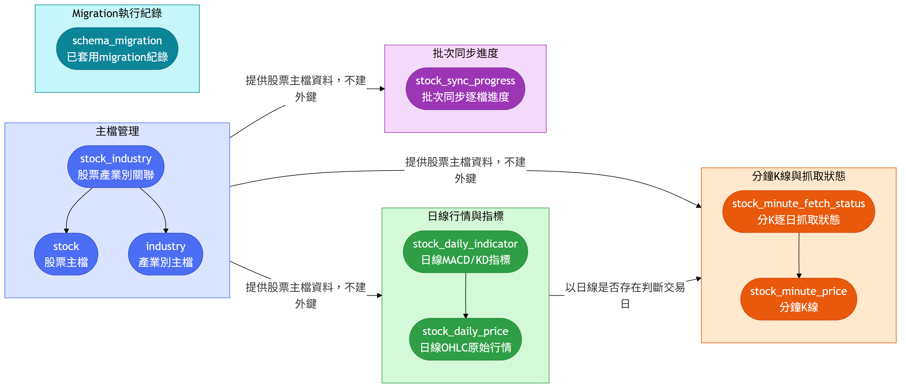
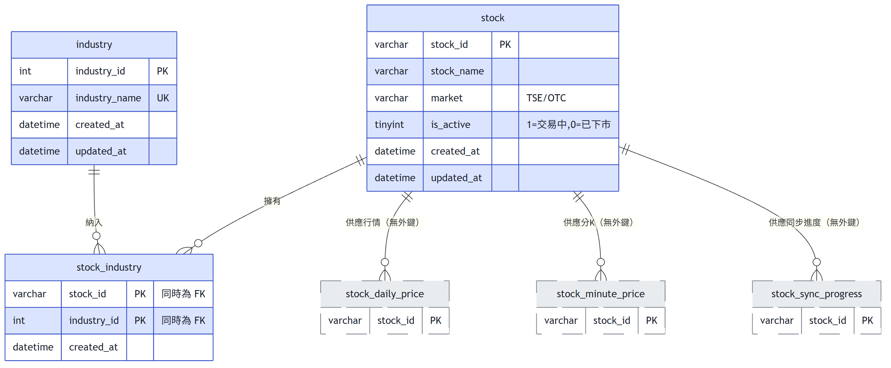
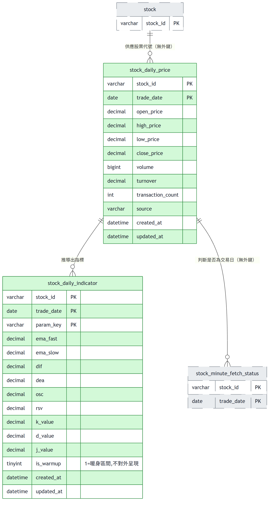
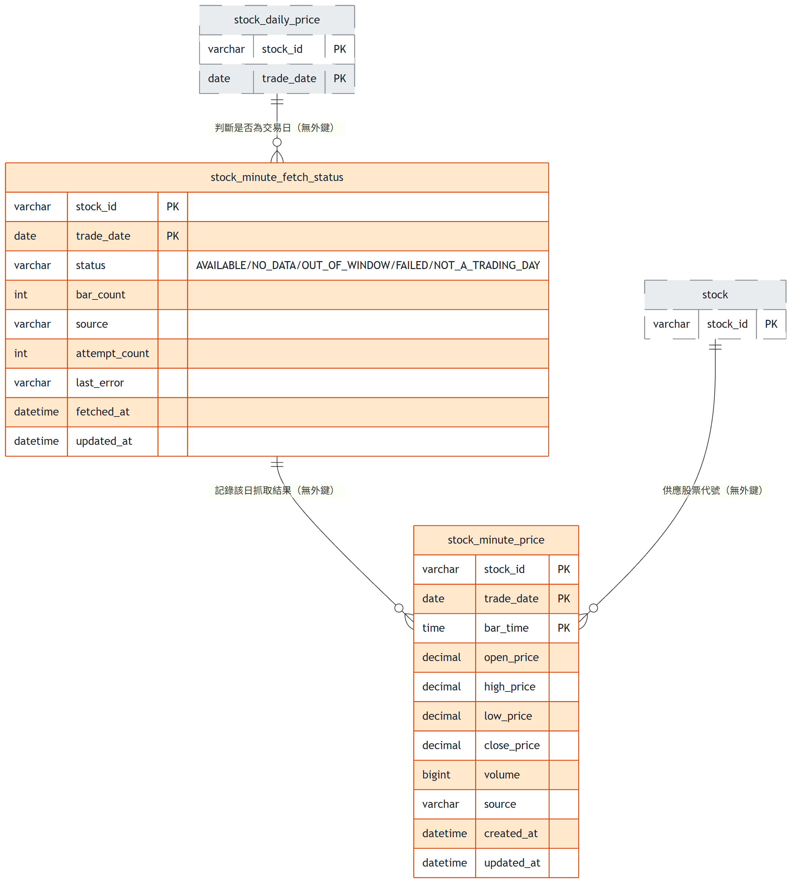
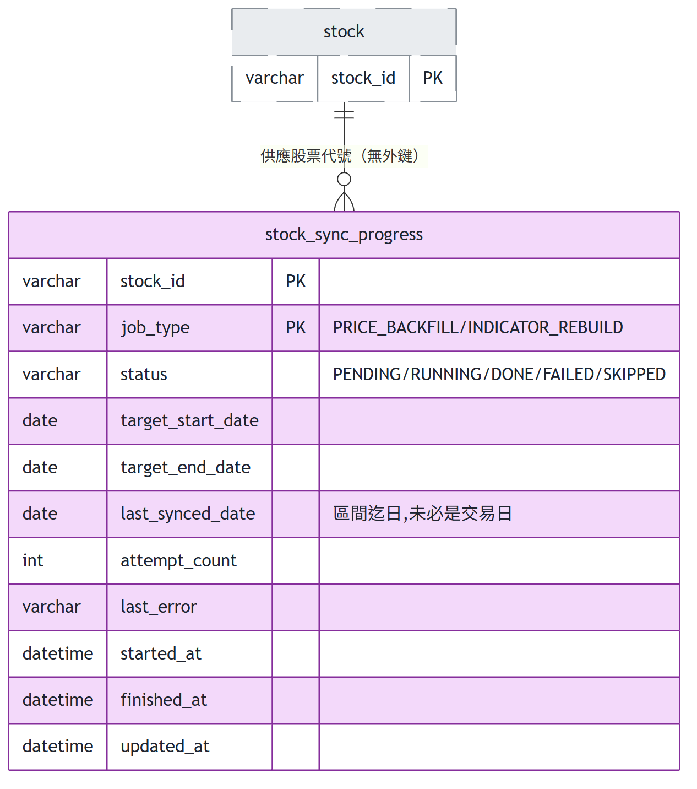
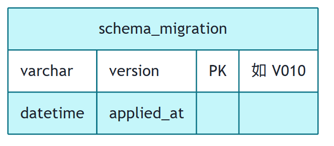

# Stock 資料庫 ER 模型全覽

本資料庫支撐一套股票行情與技術指標系統，涵蓋「股票與產業別基本資料」「日線行情與指標運算」「分鐘 K 線與抓取狀態」「批次同步進度」「migration 執行紀錄」五大功能區塊。這些區塊之間多數不是靠傳統外鍵串接，而是靠共用的 `stock_id`（或 `stock_id + trade_date`）鍵值鬆散關聯——這是刻意的設計取捨，詳見各群組說明與最末的資料表總覽。

## 全景

## master — 主檔管理

儲存全市場股票的代號、名稱、市場別，以及股票與產業別的多對多歸屬，是全系統代號、名稱與產業分類的權威來源。

- **stock** — 全市場股票主檔（universe），一列代表一檔股票，`stock_id` 為主鍵。與 `stock_daily_price`、`stock_minute_price`、`stock_sync_progress` **皆刻意不建外鍵**：新上市股票可能在主檔同步之前就已出現在行情快照或分 K 資料中，外鍵會讓那筆資料寫入失敗而永久遺失；行情抓取的健壯性優先於參照完整性。
- **industry** — 產業別字典表，代理主鍵 + `industry_name` 唯一鍵。不建立任何對外的外鍵（它是被參照的一方）。表本身**不做刪除**，避免主鍵在下次匯入時被重新配發而讓既有關聯失效。
- **stock_industry** — `stock` 與 `industry` 的多對多關聯表，複合主鍵 `(stock_id, industry_id)`。**這是本資料庫唯一真正建立外鍵的關聯**：`fk_si_stock`、`fk_si_industry` 皆為 `ON UPDATE CASCADE ON DELETE CASCADE`。可以安全建外鍵是因為寫入方（產業別匯入）在同一交易邊界內保證兩端先存在；`ON DELETE CASCADE` 目前不會被觸發，因為下市走 `is_active=0` 標記，`stock` 的列從不真的被刪除。

## daily-price — 日線行情與指標

儲存個股每日收盤後的 OHLC 原始行情，以及由該行情推導出的 MACD／KD 技術指標與其遞迴中間狀態。

- **stock_daily_price** — 日線 OHLC 原始成交價（未除權息還原），複合主鍵 `(stock_id, trade_date)`，是所有技術指標的唯一原始資料來源。與 `stock` 之間**無外鍵**（理由同上）。
- **stock_daily_indicator** — 由 `stock_daily_price` 的 OHLC 推導出的 MACD／KD 指標值與遞迴中間狀態，複合主鍵 `(stock_id, trade_date, param_key)`，支援同一天並存多組參數。與 `stock_daily_price` 之間**未宣告外鍵**，兩表僅以共用鍵值（`stock_id`、`trade_date`）鬆散對應，由寫入流程自行保證來源行情已存在。

## minute-price — 分鐘 K 線與抓取狀態

儲存個股單一交易日內的每分鐘 OHLCV，以及逐日抓取結果的狀態記錄，避免對查無資料的日期反覆重打外部來源。

- **stock_minute_price** — 個股單一交易日內的每分鐘 OHLCV（僅 09:00–13:30），複合主鍵 `(stock_id, trade_date, bar_time)`，以年度 `RANGE` 分區支援整段丟棄舊資料。**無外鍵**：一方面理由與 `stock` 相同，另一方面 MySQL 分區表本身也不支援外鍵。
- **stock_minute_fetch_status** — 記錄每個「股票 × 交易日」的分 K 抓取結果（`AVAILABLE`／`NO_DATA`／`OUT_OF_WINDOW`／`FAILED`／`NOT_A_TRADING_DAY`），複合主鍵 `(stock_id, trade_date)`。與 `stock_minute_price` 需在同一交易邊界內一致寫入，但**未宣告外鍵**；`NOT_A_TRADING_DAY` 的判定依據是 `stock_daily_price` 是否存在對應日線，這也只是查詢時的邏輯關聯，不是外鍵約束。

## sync-progress — 批次同步進度

記錄全市場逐檔批次作業（行情回補、指標重算）目前處理到哪一檔、哪個日期，支援長時間作業的斷點續傳與失敗重試。

- **stock_sync_progress** — 記錄每檔股票在批次作業（`PRICE_BACKFILL`／`INDICATOR_REBUILD`）中的進度，複合主鍵 `(stock_id, job_type)`，支援斷點續傳與失敗重試上限。與 `stock` 之間**無外鍵**，僅共用 `stock_id`。

## schema-migration — Migration 執行紀錄

記錄哪些「資料位移類」migration 已經套用過，作為這類非冪等 DML 語句重跑時的守門依據。

- **schema_migration** — 記錄哪些「相對位移類」migration（如 `UPDATE ... + INTERVAL 8 HOUR`）已經套用過，`version` 為主鍵。**這張表刻意不與任何業務資料表建立外鍵或共用鍵值關聯**——它不描述業務資料，只是執行位移類 DML 時的冪等性守門機制；哪些表的哪些欄位曾被位移過，是寫在各自 spec 的 `Migration SQL` 段落裡，而不是靠資料庫層級的關聯表達。
