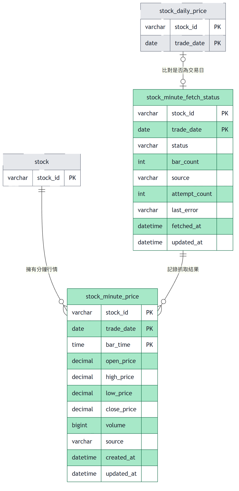

# 台股行情資料庫 ER 模型

本資料庫涵蓋台股全市場的行情資料與其衍生計算，記錄從「有哪些股票」「每天／每分鐘價格多少」到「技術指標如何逐日推進」「長時間批次作業進行到哪裡」的完整資料生命週期。整體依業務功能拆分為四個群組：**市場資料**（股票主檔與日線行情）、**技術指標**（MACD／KD 推導結果）、**分鐘資料**（分 K 行情與抓取狀態）、**批次同步**（長時間回補作業的逐檔進度）。本庫依明確設計決策**不使用任何實體外鍵**，各表之間的關聯皆為透過共用鍵欄位（`stock_id`、`trade_date` 等）建立的**邏輯關聯**，並非資料庫層強制的參照完整性約束。

## 全景

## market-data（市場行情）

市場資料涵蓋全市場股票的靜態身分資料與每日已收盤的 OHLC 行情，是本資料庫所有下游計算與展示的事實基礎。

- **stock**：全市場股票 universe 主檔，提供股票代號、名稱、市場別，供回補排程列舉標的、供 API 取用中文名稱。以 UPSERT 冪等寫入；股票更名時直接覆蓋為最新名稱，不保留名稱異動歷史。**不與 `stock_daily_price` 建立外鍵**——理由是新上市股票可能在主檔同步之前就出現在當日行情資料中，外鍵會讓該筆行情寫入失敗而遺失資料，孤兒代號改由對帳查詢檢出而非約束阻擋。`is_active=0`（下市）僅停止其進入未來的每日抓取與回補排程，既有的歷史行情資料不可刪除。
- **stock_daily_price**：儲存個股每一交易日的 OHLC 與成交量，是**所有技術指標的唯一原始資料來源**；僅存已收盤日線，價格一律為原始成交價（未經除權息還原）。以 `(stock_id, trade_date)` 複合主鍵、UPSERT 冪等寫入，重跑同一天的抓取即完成修正、不產生重複列。規格明訂**不與 `stock` 建立外鍵**，理由同上。

## indicator（技術指標）

技術指標涵蓋由日線 OHLC 推導出的 MACD 與 KD 指標值，並保存遞迴計算所需的中間狀態以支援逐日增量推進。

- **stock_daily_indicator**：由 `stock_daily_price` 的 OHLC 推導出的 MACD／KD 每日指標值，同時保存 `ema_fast`／`ema_slow`／`k_value`／`d_value` 等遞迴中間狀態，使隔日只需讀取前一日一列狀態即可推進一步，而非每次全量重算整條序列。主鍵含 `param_key` 以支援同一檔同一天並存多組參數的計算結果。`is_warmup=1` 的列是遞迴鏈的必要環節、必須寫入但不得對外呈現，以旗標區分而非刪除。規格並未定義與 `stock_daily_price` 之間的外鍵，兩表僅靠 `(stock_id, trade_date)` 邏輯對應。

## minute-data（分鐘 K 線）

分鐘資料涵蓋前端點選日 K 後隨選抓取的單日分鐘級 K 棒，以及對應的逐日抓取狀態，用以避免對無資料日期重複請求外部來源。

- **stock_minute_price**：儲存個股單一交易日內每分鐘的 OHLCV，供前端分 K 圖表讀取；只存 09:00–13:30 正常交易時段的 K 棒，該分鐘無成交即不寫入該列（不補零）。以 `(stock_id, trade_date, bar_time)` 複合主鍵、UPSERT 冪等寫入；依 `trade_date` 以 `RANGE (TO_DAYS(trade_date))` 逐年分區，清理舊資料以 `DROP PARTITION` 整段丟棄而非逐列 `DELETE`。分區表本身不支援外鍵，且規格明訂刻意**不與 `stock` 建立外鍵**（理由同 `stock`）。
- **stock_minute_fetch_status**：記錄每一「股票 × 交易日」的分 K 抓取結果（`AVAILABLE`／`NO_DATA`／`OUT_OF_WINDOW`／`FAILED`／`NOT_A_TRADING_DAY`），用以避免對永遠取不到資料的日期反覆向外部來源請求。`NOT_A_TRADING_DAY` 的判定依據即該 `(stock_id, trade_date)` 在 `stock_daily_price` 中是否存在對應日線。規格明訂本表必須與 `stock_minute_price` 在**同一個交易邊界內寫入**，避免「K 棒已寫入但狀態仍為 FAILED」或「狀態為 AVAILABLE 但 K 棒未寫入」的不一致；清除舊分 K 分區時，對應日期的狀態列也**必須一併刪除**，否則狀態表會宣稱 `AVAILABLE` 而 K 棒已隨分區消失——這些一致性要求由應用層的寫入邏輯負責，資料庫本身無外鍵或觸發器保證。

## sync-job（批次同步）

批次同步涵蓋全市場逐檔進行的長時間批次作業（行情回補、指標重算）之逐檔進度記錄，用以支援斷點續傳與失敗重試。

- **stock_sync_progress**：記錄每檔股票在長時間批次作業（`PRICE_BACKFILL` 行情回補、`INDICATOR_REBUILD` 指標重算）中的當前進度，以 `(stock_id, job_type)` 為主鍵支援斷點續傳。以 `last_synced_date` 記錄已成功處理到的交易日，續傳時從此之後接續而非重跑整個區間；以 `status` 明確區分 `PENDING`／`RUNNING`／`DONE`／`FAILED`（可重試）／`SKIPPED`（不可重試，如該檔區間內無交易資料），`attempt_count` 設定重試上限避免單一標的卡住整批作業。批次啟動時以 UPSERT 對目標標的建立或重置為 `PENDING`。
