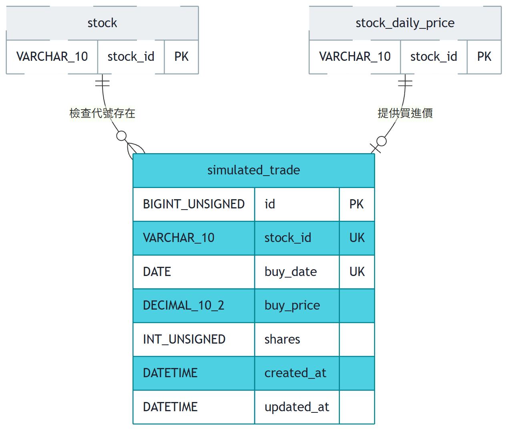

# 股票資料庫 ER 模型總覽

本資料庫支撐一套台股分析與模擬交易系統，涵蓋股票／產業別主檔、日線行情與技術指標、三大法人買賣超籌碼、分鐘級 K 線與其抓取狀態、批次作業進度、使用者模擬持股，以及 migration 執行紀錄，共七個主要功能。除「主檔管理」內部的 `stock_industry` 關聯表外，各功能的事實表與主檔之間刻意**不建實體外鍵**，一律以共用的 `stock_id`（或 `stock_id` + `trade_date`）鍵在邏輯上對應——理由是行情類資料的寫入健壯性優先於參照完整性，新上市股票可能先出現在行情快照才補進主檔，外鍵會讓當下無法重取的行情寫入失敗。

## 全景

## master — 股票與產業主檔

此叢集是全系統的股票與產業別字典，統計、回補、策略掃描與模擬交易都以此取得標的清單與名稱。

- **stock**：全市場股票的代號、名稱、市場別與是否仍在交易，作為回補排程 universe 與統計結果的名稱來源；不對任何行情表建外鍵，避免新股行情因主檔未同步而寫入失敗，下市一律走 `is_active = 0`、列從不刪除。
- **industry**：產業別字典表，由交易所基本資料匯入時遇到沒見過的分類就自動補上，不預先種入資料；本表不做刪除以保持代理主鍵穩定。
- **stock_industry**：`stock` 與 `industry` 的多對多關聯，一檔股票可屬多個產業別，是本 schema 唯一宣告外鍵的表（`fk_si_stock`、`fk_si_industry`，皆 `ON UPDATE CASCADE ON DELETE CASCADE`）；因下市走旗標、`stock` 列從不刪除，`ON DELETE CASCADE` 目前不會被觸發，屬防禦性設計。

## daily-price — 日線行情與指標

此叢集儲存日線 OHLC 原始行情與由其推導的 MACD／KD 指標，是統計與策略功能的核心事實資料。

- **stock_daily_price**：每檔股票每個已收盤交易日的 OHLC、成交量與成交金額，價格未經除權息還原，是所有技術指標的唯一原始資料來源，其成交量同時是法人籌碼型態佔比與強度的分母；與 `stock` 之間不建外鍵。
- **stock_daily_indicator**：由 `stock_daily_price` 的 OHLC 推導的 MACD（`dif`／`dea`／`osc`）與 KD（`k_value`／`d_value`／`j_value`）指標，連同遞迴中間狀態（`ema_fast`／`ema_slow`）一併落地以支援逐日增量推進；主鍵含 `param_key` 以支援多組參數並存，與 `stock_daily_price` 未宣告外鍵，僅以 `(stock_id, trade_date)` 共用鍵對應。

## institutional-trade — 三大法人買賣超

此叢集儲存交易所三大法人買賣超日報的逐檔逐日數字，供法人籌碼型態的策略掃描使用。

- **stock_institutional_trade**：三大法人（外資不含外資自營商、外資自營商、投信、自營商合計／自行買賣／避險）逐日買進／賣出／買賣超股數，十七個數值欄位依資料源原樣保存、不做任何加總合併，單位一律為股，與 `stock_daily_price.volume` 同單位；不建任何外鍵，與 `stock_daily_price` 是策略掃描依 `(stock_id, trade_date)` 相除算佔比與強度時的邏輯關聯。資料源只列出有法人交易的證券，因此不寫補零列。

## minute-price — 分 K 行情與抓取狀態

此叢集儲存隨點選隨抓取的分鐘 K 線與其抓取結果狀態，避免對同一個「查無資料」的日期重複請求外部來源。

- **stock_minute_price**：個股單一交易日的每分鐘 OHLCV，僅存 1 分鐘 K 棒（5／15／30／60 分由查詢時聚合，不落地），以年度 `RANGE` 分區支援整段捨棄；分區表不支援外鍵，亦沿用不對 `stock` 建外鍵的決定。
- **stock_minute_fetch_status**：記錄每個「股票 × 交易日」的分 K 抓取結果（`AVAILABLE`／`NO_DATA`／`OUT_OF_WINDOW`／`FAILED`／`NOT_A_TRADING_DAY`），避免對永遠取不到資料的日期重複打外部 API；須與 `stock_minute_price` 在同一交易邊界內寫入以維持一致，但兩表間同樣未宣告外鍵，僅以 `(stock_id, trade_date)` 共用鍵對應。

## sync-progress — 批次同步進度

此叢集記錄全市場逐檔批次作業（行情回補、指標重算）的進度，支援中斷後的斷點續傳與失敗重試。

- **stock_sync_progress**：記錄「一檔股票 × 一種批次作業（`PRICE_BACKFILL`／`INDICATOR_REBUILD`）」的當前進度與 `last_synced_date`（記的是區間迄日而非最後交易日），支援斷點續傳與 `attempt_count` 重試上限；沒有外鍵，`stock_id` 僅為與 `stock` 共用的邏輯鍵。三大法人買賣超的補齊不使用本表。

## simulated-trade — 模擬交易

此叢集儲存使用者在模擬交易分頁自行建立的持股，只保存建立當下決定的事實，未實現損益等隨行情變動的數字一律即時計算、不落地。

- **simulated_trade**：一列代表使用者建立的一筆模擬持股，只存建立當下就決定、之後不該再變的事實——`stock_id`、`buy_date`（今日以前最後一個有收盤價的交易日）、`buy_price`（該日收盤價，型別與 `stock_daily_price.close_price` 同為 `DECIMAL(10,2)`）與 `shares`（目前固定 1000 股）；未實現損益、報酬率、現價、手續費與證交稅都不存。`UNIQUE KEY uk_stock_buy_date (stock_id, buy_date)` 讓同一檔同一買進日只能有一筆，重複加入由資料庫擋下並回報成明確錯誤（寫入一律 `INSERT`，不得 UPSERT）。不對 `stock` 建外鍵，除了行情表共通的理由外還多一條：股票下市或從主檔被刪掉時，使用者的模擬紀錄不該跟著消失；刪除以 `id` 硬刪除一列，不做軟刪除旗標。

## schema-migration — Migration 執行紀錄

此叢集只有一張守門表，記錄哪些「資料位移類」migration 已經執行過，讓相對位移的 SQL 可以安全重跑而不重複套用。

- **schema_migration**：以版本號（`V0xx`）為主鍵，記錄哪些相對位移類 migration（`stock` 的 V011、`stock_daily_price` 的 V012、`stock_sync_progress` 的 V010，皆為 UTC→Asia/Taipei 的時間戳 +8 小時修正）已經套用過，是這類非冪等 SQL 唯一可靠的重跑守門依據；本身不對任何表建外鍵，與任何業務資料表都沒有資料關聯。
