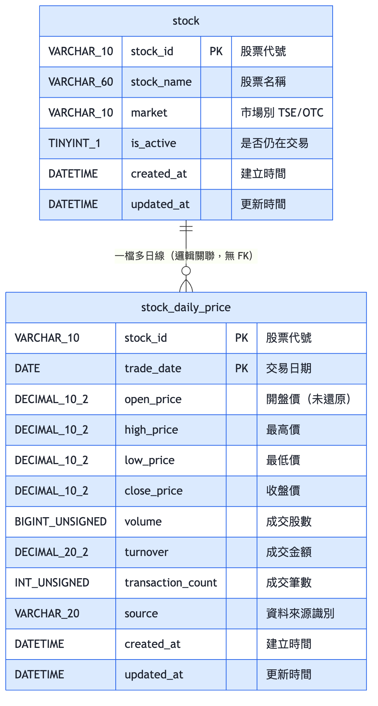
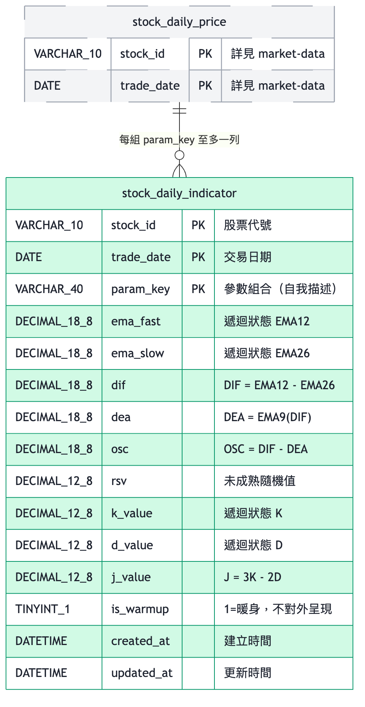
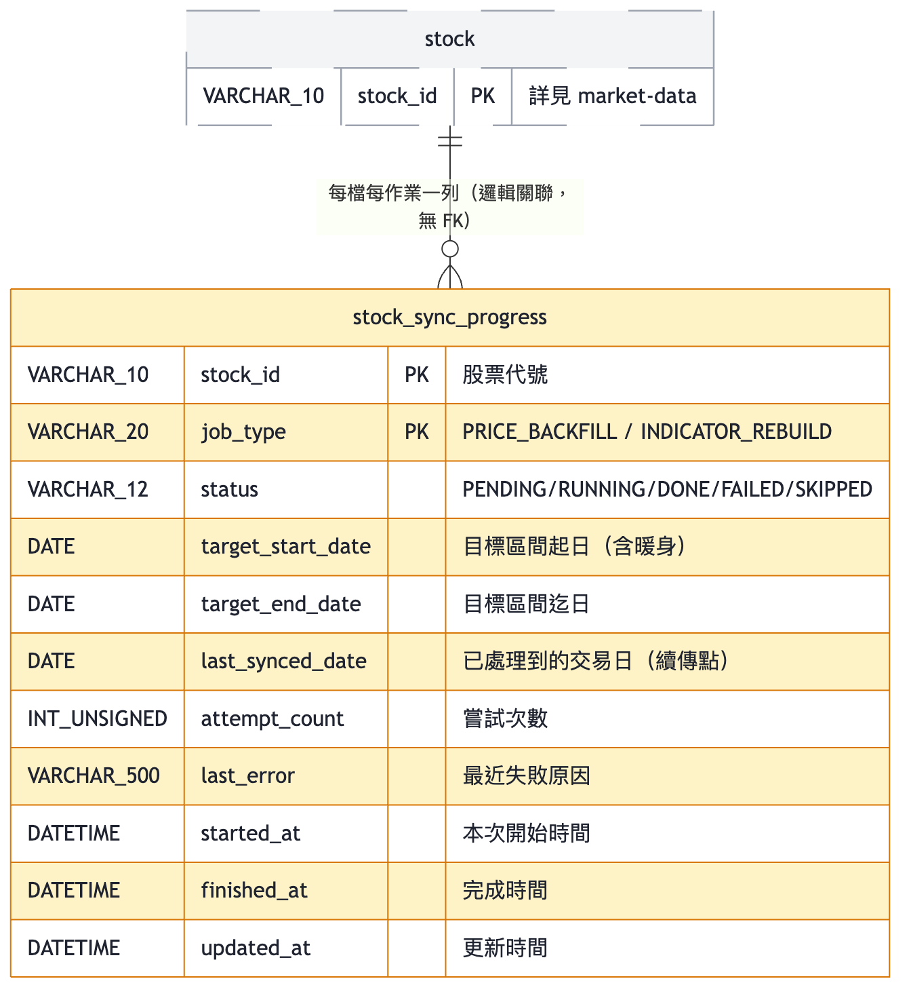

# 台股日線行情與技術指標統計資料庫 ER 模型

本資料庫支撐「台股日線行情與技術指標統計」需求，涵蓋從全市場股票清單、每日 OHLC 原始行情、MACD／KD 技術指標運算，到長時間批次作業進度追蹤的完整資料骨幹。四張資料表依業務功能分為三個群組：**market-data（市場行情）**、**indicator（技術指標）**、**sync-job（批次同步）**。

整套 schema 刻意**不建立任何實體外鍵（FK）約束** —— 所有跨表關聯（皆以 `stock_id` 為主）都是邏輯關聯。理由是讓抓取端的健壯性優先於參照完整性：新上市股票的行情可能在主檔同步之前就出現在當日快照中，外鍵會讓該筆行情寫入失敗而遺失資料。孤兒代號由對帳查詢檢出，而非由約束阻擋。

## 全景

## market-data（市場行情）

涵蓋「有哪些股票」與「這些股票每天的原始成交行情」兩件事，是全系統唯一的行情事實來源。

- **`stock`（股票主檔）** — 全市場股票 universe，供回補排程列舉標的、供 API 取得中文名稱。以 `stock_id` 為主鍵，UPSERT 維護；股票更名時直接覆蓋 `stock_name`，不保留名稱異動歷史。`is_active` 標記下市／終止交易的標的，下市後不再進入每日抓取與回補排程，但其在 `stock_daily_price` 的歷史資料不可刪除。與 `stock_daily_price` 之間刻意不建外鍵，理由見開頭。
- **`stock_daily_price`（股票日線行情）** — 唯一的技術指標原始資料來源，僅存已收盤、**未經除權息還原**的原始成交價（還原價會隨每次除權息事件整段變動，破壞歷史指標的可重現性）。主鍵為 `(stock_id, trade_date)` **複合叢集鍵**，刻意不用 `AUTO_INCREMENT` 代理鍵：叢集索引使同一檔股票的歷史在磁碟上連續存放，讓「單檔＋日期區間」查詢退化為順序掃描而非大量隨機 I/O。四個價格欄位一律 `DECIMAL(10,2)`，嚴禁 `FLOAT`／`DOUBLE` —— MACD／KD 為遞迴指標，浮點誤差會沿遞迴鏈逐日累積。寫入採 UPSERT，保證重跑同一日的抓取為冪等操作；`CHECK (high_price >= low_price)` 阻擋髒資料。

## indicator（技術指標）

涵蓋由行情 OHLC 推導出的 MACD／KD 指標，以及支援逐日增量推進所需的遞迴中間狀態。

- **`stock_daily_indicator`（技術指標）** — 由 `stock_daily_price` 的 OHLC 依 `stock_id + trade_date` 推導而成。主鍵為 `(stock_id, trade_date, param_key)`，欄位順序刻意將 `param_key` 置於最後，讓同一檔的指標序列在磁碟上連續存放，支撐「單檔＋日期區間＋單一參數組」的主鍵範圍掃描；若把 `param_key` 前置，同一檔的資料會被參數組切散。`param_key` 自我描述完整參數（如 `MACD_12_26_9__KD_9_3_3`），不透過對照表，並允許同一檔同一天並存多組參數結果。
  表內**不只存指標輸出值**（`dif`／`dea`／`osc`／`k_value`／`d_value`／`j_value`），**也存遞迴中間狀態**（`ema_fast`、`ema_slow`）—— 這是增量推進設計的關鍵：少存這兩欄，隔日就無法接續推進，整個增量設計會退化為每日全量重算。MACD 相關欄位用 `DECIMAL(18,8)`、KD 相關用 `DECIMAL(12,8)`，同樣嚴禁浮點型別。
  `is_warmup` 標記序列開頭尚未收斂的列：這些列**必須寫入**（是遞迴鏈的必要環節）但**不得對外呈現**，故以旗標區分而非刪除。
  欄位命名刻意迴避有歧義的 `macd` 一詞 —— 台股慣例中「MACD」指訊號線（本表的 `dea`），國外慣例中則指 `dif`，改用三個明確欄位名可避免前後端對接時對錯欄位。

## sync-job（批次同步）

涵蓋長時間、逐檔進行的批次作業（行情回補、指標重算）之進度記錄，支援斷點續傳與失敗重試。

- **`stock_sync_progress`（批次同步進度）** — 記錄「一檔股票 × 一種批次作業」的當前進度，主鍵 `(stock_id, job_type)`，`job_type` 為 `PRICE_BACKFILL`（行情回補）或 `INDICATOR_REBUILD`（指標重算）。
  此表存在的直接原因是外部資料源的限制：免費層不支援一次取得全市場，全市場回補因此是約 2200 次外部請求的長時間作業，必然會因速率限制、網路中斷或程序重啟而中途停止。`last_synced_date` 記錄已成功處理到的交易日，續傳時從此日期之後接續，而非重跑整個區間。
  明確區分 `FAILED`（可重試）與 `SKIPPED`（區間內無交易資料，不需重試），避免重試排程對永遠不會成功的標的反覆嘗試。`last_error` 保留最近一次失敗原因供診斷 —— 2200 檔中失敗的少數幾檔，沒有這欄就無從查起；`attempt_count` 設定重試上限，避免單一標的無限重試卡住整批作業。`status` 與 `job_type` 皆以 CHECK 約束限制列舉值。
