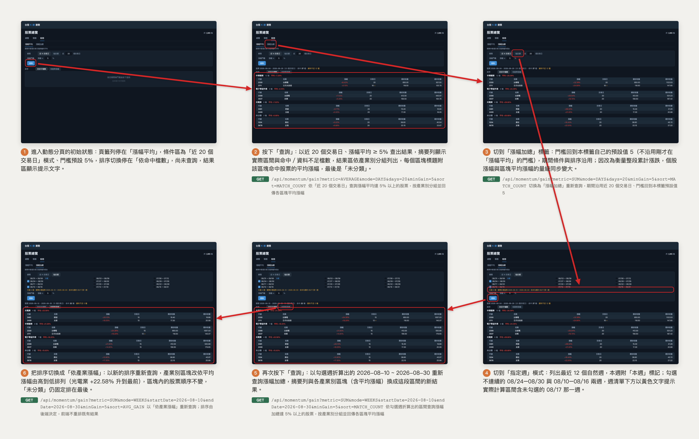

# 動態（產業別漲幅）

從進入動態分頁開始，走過「查詢近 20 個交易日的漲幅平均 → 切到漲幅加總 → 改用指定週模式挑週 → 再查一次 → 改依產業漲幅排序」的完整流程，結果一律按產業別分組列出，每個區塊標題附該區塊命中股票的平均漲幅。

放大瀏覽：[瀏覽器開啟 (storyboard.html)](momentum/storyboard.html) ・ [PDF](momentum/storyboard.pdf)

## 呼叫的後端 API

分鏡上每一格已標註該步驟送出的請求，以下為同一份清單的表格版本。

| 步驟 | 觸發 | 後端 API | 用途 | 契約 |
|---|---|---|---|---|
| 1 | 進入動態分頁 | — | 進頁不發任何請求；條件區帶預設值（近 20 個交易日、門檻 5%、排序依命中檔數），等使用者按「查詢」 | — |
| 2 | 點「查詢」 | `GET /api/momentum/gain?metric=AVERAGE&mode=DAYS&days=20&minGain=5&sort=MATCH_COUNT` | 依「近 20 個交易日」查詢漲幅平均達 5% 以上的股票，按產業別分組並回傳各區塊平均漲幅 | [industry-gain-ranking](../backend/industry-gain-ranking.md) |
| 3 | 切到「漲幅加總」標籤 | `GET /api/momentum/gain?metric=SUM&mode=DAYS&days=20&minGain=5&sort=MATCH_COUNT` | 切換度量後重新查詢；期間與排序沿用，門檻回到本標籤自己的預設值 5（**不沿用**另一個標籤輸入的值） | [industry-gain-ranking](../backend/industry-gain-ranking.md) |
| 4 | 切到「指定週」模式並勾選週 | — | 純前端操作：週清單、勾選、以及「實際計算區間含未勾選那一週」的提示全部在前端算，不發請求 | — |
| 5 | 點「查詢」 | `GET /api/momentum/gain?metric=SUM&mode=WEEKS&startDate=2026-08-10&endDate=2026-08-30&minGain=5&sort=MATCH_COUNT` | 依勾選週折算出的區間查詢漲幅加總達 5% 以上的股票，按產業別分組並回傳各區塊平均漲幅 | [industry-gain-ranking](../backend/industry-gain-ranking.md) |
| 6 | 排序切成「依產業漲幅」 | `GET /api/momentum/gain?metric=SUM&mode=WEEKS&startDate=2026-08-10&endDate=2026-08-30&minGain=5&sort=AVG_GAIN` | 以新的排序重新查詢；排序由後端決定，前端不重排既有結果，「未分類」在兩種排序下都固定排最後 | [industry-gain-ranking](../backend/industry-gain-ranking.md) |

本流程只呼叫一支端點，且**不呼叫**任何寫入類端點——漲幅與各產業別的平均漲幅完全由後端即時運算，不落地結果。區塊標題上的平均漲幅只統計該區塊列出的命中股票，因此必然 ≥ 門檻，不代表該產業整體表現。產業別分組所依賴的對照資料不由本頁維護：它是[策略分頁](strategy.md)「更新股票清單」那一次 `POST /api/stocks/universe/import` 一併匯入的，動態分頁上刻意沒有同功能的按鈕。週的邊界（週一至週日）由前端換算後只送出一組起訖日，後端不認識「週」這個概念，因此第 4 步沒有對應的請求；切換排序則相反，一律回到後端重查，前端不自行重排。
