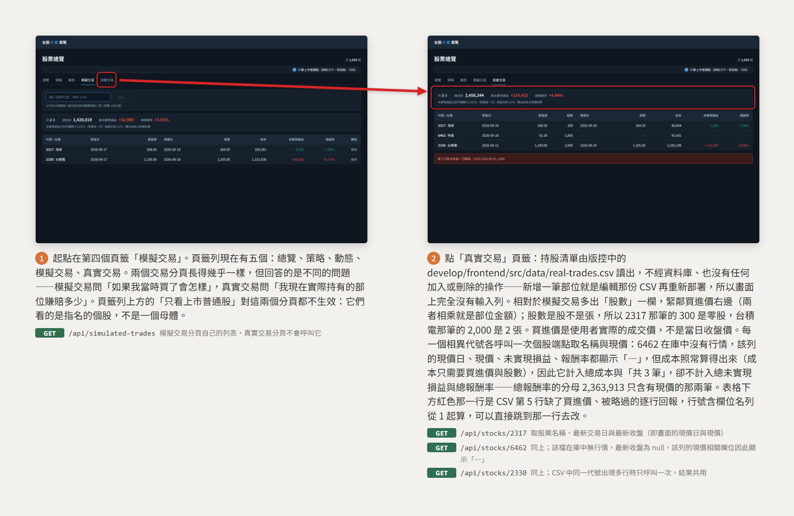

# 真實交易

從模擬交易分頁切到第五個頁籤「真實交易」，看見一份由版控中的 CSV 提供、完全唯讀的實際持股清單。

放大瀏覽：[瀏覽器開啟 (storyboard.html)](real-trade/storyboard.html) ・ [PDF](real-trade/storyboard.pdf)

## 呼叫的後端 API

分鏡上每一格已標出該步驟送出的請求，這裡是同一份清單的文字版，一列一個呼叫。

| 步驟 | 觸發 | 後端 API | 用途 | 契約 |
|---|---|---|---|---|
| 1 | 停留在模擬交易分頁 | `GET /api/simulated-trades` | 模擬交易分頁自己的列表，真實交易分頁**不會**呼叫它 | [simulated-trade](../backend/simulated-trade.md) |
| 2 | 點「真實交易」頁籤 | `GET /api/stocks/2317` | 取股票名稱、最新交易日與最新收盤（即畫面的現價日與現價） | [stock-catalog](../backend/stock-catalog.md) |
| 2 | 同上 | `GET /api/stocks/6462` | 同上；該檔在庫中無行情，最新收盤為 `null`，該列現價相關欄位顯示「—」 | [stock-catalog](../backend/stock-catalog.md) |
| 2 | 同上 | `GET /api/stocks/2330` | 同上；CSV 中同一代號出現多行時只呼叫一次，結果共用 | [stock-catalog](../backend/stock-catalog.md) |

本流程**不呼叫**任何寫入端點——沒有 `POST`、`PUT` 或 `DELETE`。持股資料來自隨程式碼一起版控的 `develop/frontend/src/data/real-trades.csv`，它是打包進前端的靜態檔而不是一次網路請求，因此不列在上表中；新增或移除一筆部位的唯一方式是編輯那份 CSV 再重新部署。成本、未實現損益與報酬率在前端算出，用的是與 [simulated-trade](../backend/simulated-trade.md) 完全相同的一套交易成本定義（手續費 0.1425% 買賣各一次、證交稅 0.3% 只在賣出、三項各自無條件捨去至整數元），本頁**不呼叫**模擬交易的端點來取得這些數字。

## 分鏡沒有畫到的

這個分頁**沒有任何頁內互動**——不能新增、不能刪除、列不可點、表頭不可排序——所以分鏡只有兩格：唯一真實的動作就是那一次頁籤切換。spec 另外規定的兩種降級狀態（CSV 某一行格式有誤被略過、某檔查不到現價）不是使用者按得出來的，因此併在第 2 格的同一個畫面裡一起呈現，而不是各給一格。
