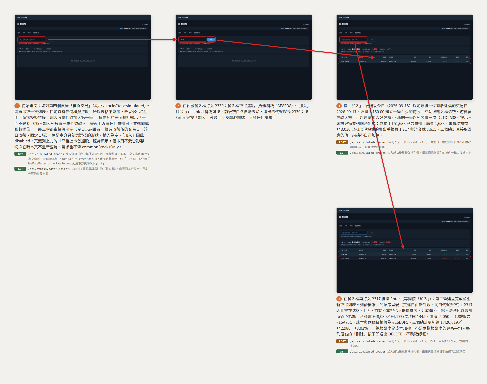

# 模擬交易分頁

從空的模擬交易分頁開始，走過「輸入代號 2330 → 加入第一筆持股（表格與三個總計出現） → 再輸入 2317 按 Enter 加入第二筆（兩列、總計更新）」的完整流程——使用者只給代號，買進日、買進價與固定 1 張都由後端決定。

放大瀏覽：[瀏覽器開啟 (storyboard.html)](simulated-trade/storyboard.html) ・ [PDF](simulated-trade/storyboard.pdf)

## 呼叫的後端 API

分鏡上每一格已標出該步驟送出的請求，這裡是同一份清單的文字版，一列一個呼叫。

| 步驟 | 觸發 | 後端 API | 用途 | 契約 |
|---|---|---|---|---|
| 1 | 進入分頁（含由其他分頁切回、重新整理） | `GET /api/simulated-trades` | 取 `items[]` 與三個總計，以及 `feeRatePercent`／`taxRatePercent`／`asOfDate`；無持股時 `items` 為 `[]`、`totalReturnPercent` 為 `null`，畫面顯示三個「—」 | [simulated-trade](../backend/simulated-trade.md) |
| 1 | 進頁載入 | `GET /api/stocks?page=1&size=1` | 只取 `total` 顯示 `/stocks` 頁面層級常駐的「共 N 檔」，與本分頁的持股無關 | [stock-catalog](../backend/stock-catalog.md) |
| 2 | 在輸入框打入代號 | —（不發請求） | 純前端：輸入非空即啟用「加入」，前後空白於送出前去除 | [simulated-trade](../backend/simulated-trade.md) |
| 3 | 按「加入」 | `POST /api/simulated-trades` | body 只有 `stockId`；買進日（今日以前最後一個 `close_price > 0` 的交易日）、買進價（該日收盤）與股數（固定 1,000）都由後端決定，呼叫端不得指定 | [simulated-trade](../backend/simulated-trade.md) |
| 3 | 加入成功後 | `GET /api/simulated-trades` | 重新取得列表，讓三個總計與列的排序一律由後端決定（前端不自行加總、不重排） | [simulated-trade](../backend/simulated-trade.md) |
| 4 | 在輸入框按 Enter（等同按「加入」） | `POST /api/simulated-trades` | 同一支端點；Enter 與按鈕沒有行為差異 | [simulated-trade](../backend/simulated-trade.md) |
| 4 | 加入成功後 | `GET /api/simulated-trades` | 重新取得列表，兩筆與更新後的三個總計都由這次回應決定 | [simulated-trade](../backend/simulated-trade.md) |
| 4 | 按某列的「刪除」（分鏡未走到） | `DELETE /api/simulated-trades/{id}` | 立即刪除、不跳確認框，成功後同樣重新取得列表 | [simulated-trade](../backend/simulated-trade.md) |

本流程**不抓取任何外部資料**：三支端點都只讀 `stock` 的名稱與 `stock_daily_price` 已入庫的收盤價做四則運算，不向交易所發出請求、不建立同步進度列，也不做任何型態判定或回測——收盤價由[策略分頁](strategy.md)那條線的日 K 同步負責寫入。本頁也**不送** `commonStocksOnly`：頁籤列上方的「只看上市普通股」對它不生效，使用者指名哪一檔就是哪一檔（含 ETF 與已下市股票），切換那個勾選框時本頁不重新查詢。未實現損益、報酬率與現價都由後端每次查詢當下即時算出，前端一個數字都不重算。
