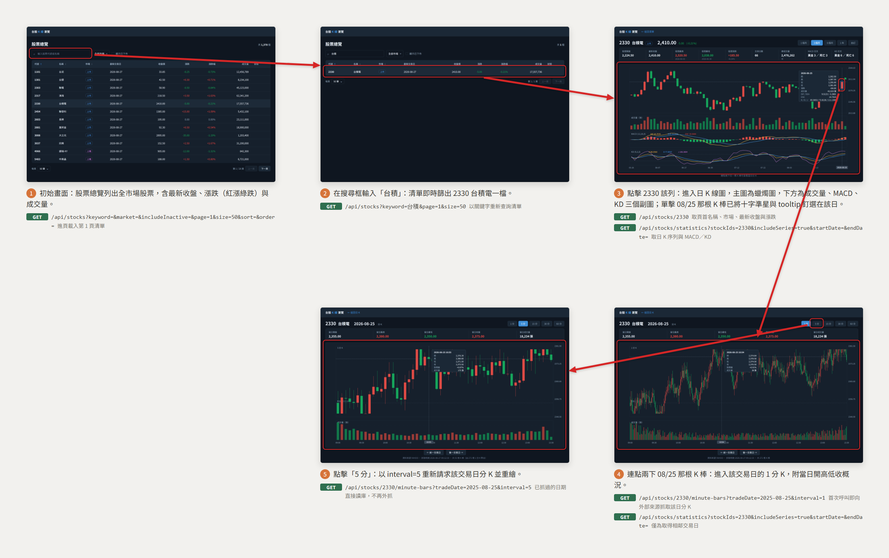

# 股票 K 線瀏覽

從股票總覽清單搜尋並選定一檔股票，進入日 K 線圖，再連點兩下圖上某一個交易日查看該日分 K 的完整流程。

放大瀏覽：[瀏覽器開啟 (storyboard.html)](stock-chart/storyboard.html) ・ [PDF](stock-chart/storyboard.pdf)

## 呼叫的後端 API

每一步在圖上就標了它打哪幾支 API，這裡是同一份對照，附後端契約連結。

| 步驟 | 觸發 | 後端 API | 用途 | 契約 |
|---|---|---|---|---|
| 1 | 進入股票總覽 | `GET /api/stocks?keyword=&market=&includeInactive=&page=1&size=50&sort=&order=` | 讀第 1 頁清單與各檔最新收盤、漲跌 | [stock-catalog](../backend/stock-catalog.md) |
| 2 | 搜尋框輸入關鍵字 | `GET /api/stocks?keyword=台積&page=1&size=50` | 以關鍵字重新查詢清單（篩選、換頁、排序同此支） | [stock-catalog](../backend/stock-catalog.md) |
| 3 | 點擊清單某一列 → 日 K 頁 | `GET /api/stocks/2330` | 頁首的名稱、市場、最新收盤與漲跌 | [stock-catalog](../backend/stock-catalog.md) |
| 3 | 點擊清單某一列 → 日 K 頁 | `GET /api/stocks/statistics?stockIds=2330&includeSeries=true&startDate=&endDate=` | 日 K 序列與 MACD／KD 指標（切換區間時重打） | [stock-indicator-statistics](../backend/stock-indicator-statistics.md) |
| 4 | 連點兩下某根 K 棒 → 分 K 頁 | `GET /api/stocks/2330/minute-bars?tradeDate=2025-08-25&interval=1` | **這支就是開始抓資料的入口**：該「股票×交易日」若尚未抓過，本次呼叫即向外部來源抓取並落地，之後才直接讀庫 | [stock-minute-price](../backend/stock-minute-price.md) |
| 4 | 連點兩下某根 K 棒 → 分 K 頁 | `GET /api/stocks/statistics?stockIds=2330&includeSeries=true&startDate=&endDate=` | 僅為取得相鄰交易日，供「前／後一交易日」切換 | [stock-indicator-statistics](../backend/stock-indicator-statistics.md) |
| 5 | 切換週期（5／15／30／60 分） | `GET /api/stocks/2330/minute-bars?tradeDate=2025-08-25&interval=5` | 以新週期重新請求並重繪；已抓過的日期直接讀庫，不再外抓 | [stock-minute-price](../backend/stock-minute-price.md) |

本流程不呼叫任何寫入型 API。行情與指標的產生（`POST /api/stocks/sync/daily`、`POST /api/stocks/sync/backfill`、`POST /api/stocks/indicators/rebuild`）屬批次作業，不由這些畫面觸發——唯一例外是上表第 4 列的分 K 隨選抓取。
