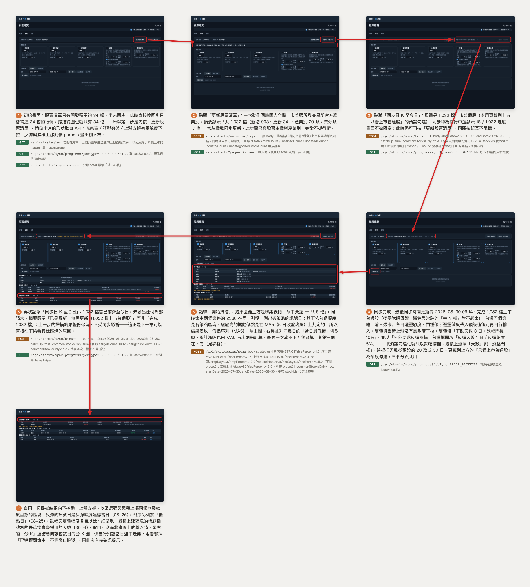

# 策略型態掃描

從只有種子股票的初始狀態，走過「更新股票清單 → 同步日 K → 勾選策略掃描 → 再同步確認已是最新 → 捲看其餘策略區塊」的完整流程。

放大瀏覽：[瀏覽器開啟 (storyboard.html)](strategy/storyboard.html) ・ [PDF](strategy/storyboard.pdf)

## 呼叫的後端 API

分鏡上每一格已標註該步驟送出的請求，以下為同一份清單的表格版本。

| 步驟 | 觸發 | 後端 API | 用途 | 契約 |
|---|---|---|---|---|
| 1 | 進入策略分頁 | `GET /api/strategies` | 取策略清單：三個有靈敏度型態的三段說明文字，以及反彈／累積上漲的 `params` 與 `paramGroups`（預設值、範圍、選用群組開關），前端不寫死 | [strategy-scan](../backend/strategy-scan.md) |
| 1 | 進入策略分頁 | `GET /api/stocks/sync/progress?jobType=PRICE_BACKFILL` | 取 `lastSyncedAt` 顯示最後同步時間 | [stock-price-ingestion](../backend/stock-price-ingestion.md) |
| 1 | 進入策略分頁 | `GET /api/stocks?page=1&size=1` | 只取 `total` 顯示常駐的「共 N 檔」 | [stock-catalog](../backend/stock-catalog.md) |
| 2 | 點「更新股票清單」 | `POST /api/stocks/universe/import` | **此端點即是向交易所抓取上市股票清單的起點，同一次呼叫也一併匯入官方產業別**；回應的 `totalActiveCount`／`insertedCount`／`updatedCount`／`industryCount`／`uncategorizedStockCount` 組成「共 N 檔（新增 X、更新 Y）・產業別 P 類，未分類 Q 檔」摘要 | [stock-universe-import](../backend/stock-universe-import.md) |
| 2 | 匯入完成後 | `GET /api/stocks?page=1&size=1` | 重取 `total` 更新常駐檔數 | [stock-catalog](../backend/stock-catalog.md) |
| 3 | 點「同步日 K 至今日」 | `POST /api/stocks/sync/backfill` | **此端點即是向 Yahoo／FinMind 逐檔抓取日線的起點**（預設 8 檔並行）；不帶 `stockIds` 代表全市場，`commonStocksOnly: true` 讓同步母體只含上市普通股 | [stock-price-ingestion](../backend/stock-price-ingestion.md) |
| 3 | 同步進行中 | `GET /api/stocks/sync/progress?jobType=PRICE_BACKFILL` | 每 5 秒輪詢更新進度條 | [stock-price-ingestion](../backend/stock-price-ingestion.md) |
| 4 | 同步完成 | `GET /api/stocks/sync/progress?jobType=PRICE_BACKFILL` | 重取 `lastSyncedAt` 與完成／失敗／略過筆數；摘要以回應的 `commonStocksOnly` 說明母體是「上市普通股」 | [stock-price-ingestion](../backend/stock-price-ingestion.md) |
| 5 | 點「開始掃描」 | `POST /api/strategies/scan` | 以五個勾選的策略即時掃描：底底高／箱型突破／上漲支撐各帶靈敏度與 `risePercent` 幅度門檻（底底高的擺動低點與遞增幅度皆在 MA5 上判定，回應的 `detail.lows` 每筆帶 `ma5` 與 `low`）；反彈改帶 `dropDays`／`dropPercent` 與 `requireRise`＋`riseDays`／`risePercent`、不帶靈敏度；累積上漲改帶 `days`（此例 30 日）與 `risePercent`、不帶靈敏度；`commonStocksOnly: true` 讓母體只含上市普通股（排除 ETF、特別股、TDR），回傳各策略命中清單、資料不足與待確認標的 | [strategy-scan](../backend/strategy-scan.md) |
| 6 | 再點「同步日 K 至今日」 | `POST /api/stocks/sync/backfill` | 全數已補齊時回應 `caughtUpCount` 等於 `targetCount`，本次一檔都不抓取；掃描結果整份保留不受影響 | [stock-price-ingestion](../backend/stock-price-ingestion.md) |
| 6 | 同步結束 | `GET /api/stocks/sync/progress?jobType=PRICE_BACKFILL` | 取 `lastSyncedAt`，時間為 Asia/Taipei | [stock-price-ingestion](../backend/stock-price-ingestion.md) |
| 7 | 向下捲動看其餘策略區塊 | —（純畫面捲動，不發請求） | 反彈的訊號日是反彈幅度達標當日、谷底另列於「低點日」；兩型態的「分 K」連結指向 `/stocks/{stockId}/minute/{signalDate}`，點了才會觸發該檔該日的分 K 抓取 | [stock-minute-price](../backend/stock-minute-price.md) |

普通股篩選來自**頁籤列上方的頁面層級設定**（三個分頁共用，由 `specs/frontend/stock-list.md` 擁有），本頁把它同時填進兩支 API 的 `commonStocksOnly`：掃描的 `POST /api/strategies/scan`，以及同步的 `POST /api/stocks/sync/backfill`。它**不是另一支 API**，也不寫任何資料表——取消勾選就會看回全部在市股票，連同步母體一起放大。兩者必須一致，否則會出現「畫面上看得到、日 K 卻永遠不會被同步」的標的。

本流程**不呼叫**任何指標運算、分 K 或漲幅排行端點——掃描讀的是同步流程已寫入的日線，指標、分 K 與產業別漲幅由各自的頁面負責。聯集表格與三張策略結果表全部由第 5 步那一次 `POST /api/strategies/scan` 的回應組成，前端不再為每個策略各發一次請求。第 2 步匯入的產業別本頁自己不用，它是給[動態分頁](momentum.md)分組顯示用的——匯入入口只在這裡有一處，動態分頁上刻意沒有同功能的按鈕。
