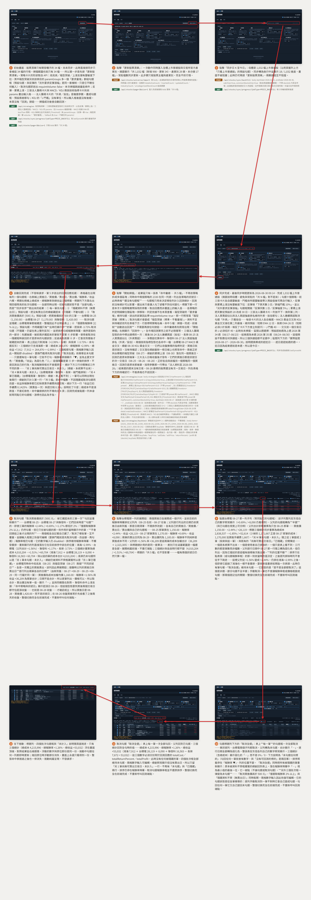

# 策略型態掃描與回測

從只有種子股票的初始狀態，走過「更新股票清單 → 同步日 K → 於十一張策略卡片中勾選三個（箱型突破、MACD 黃金交叉、站上均線）掃描 → 命中彙總表以**命中策略數由多到少**的新預設排序呈現並自動回測（五個批次框預設勾選，表格一出現就是報酬率降冪） → 取消勾選「取消買進價高於 500 元」讓被藏起來的筆勾回並重新顯示 → 展開一檔的多個買進日 → 取消其中一筆重算總計（排序位置不動） → 勾選「取消全選」 → 取消勾選「取消全選」全部勾回 → 勾選「僅選取全符合」只留下三個策略都命中過的那幾檔 → 往下捲動、三個總計浮動跟隨」的完整流程。

選三個而不是十一個策略，是因為「僅選取全符合」要求一檔被**每一個**已選策略各命中過至少一次——選滿十一個時幾乎不會有任何一檔全中，每一列都會被取消勾選、三個總計顯示「—」，那一步就看不出這個框在做什麼。

放大瀏覽：[瀏覽器開啟 (storyboard.html)](strategy/storyboard.html) ・ [PDF](strategy/storyboard.pdf)

## 呼叫的後端 API

分鏡上每一格已標出該步驟送出的請求，這裡是同一份清單的文字版，一列一個呼叫。

| 步驟 | 觸發 | 後端 API | 用途 | 契約 |
|---|---|---|---|---|
| 1 | 進頁載入 | `GET /api/strategies` | 取策略清單、靈敏度選項與說明文字，以及反彈／累積上漲／三個法人籌碼型態／MACD／KDJ 的參數定義（含外資／投信複選、MACD 短期 EMA 須小於長期 EMA 的 `lessThan` 限制、KDJ 無單位且可為負的 J 門檻）；目錄共十一筆，站上均線以 `params` 的 `maPeriods` 複選廣告 MA5／MA20／MA60（預設全選、至少一個），與法人的 `investors` 走同一套 `type: multiSelect` 機制；卡片上的群組勾選框取自各條目的 `paramGroups`——反彈的 `rise`（另外要求反彈漲幅）與箱型突破的 `volume`（要求量增，預設開啟、不轄任何參數） | [strategy-scan](../backend/strategy-scan.md) |
| 1 | 進頁載入 | `GET /api/stocks/sync/progress?jobType=PRICE_BACKFILL` | 取 `lastSyncedAt` 顯示最後同步時間 | [stock-price-ingestion](../backend/stock-price-ingestion.md) |
| 1 | 進頁載入 | `GET /api/stocks?page=1&size=1` | 只取 `total` 顯示常駐的「共 N 檔」 | [stock-catalog](../backend/stock-catalog.md) |
| 2 | 按「更新股票清單」 | `POST /api/stocks/universe/import` | **此端點即是向交易所抓取上市股票清單的起點**，同時匯入官方產業別 | [stock-universe-import](../backend/stock-universe-import.md) |
| 2 | 匯入完成 | `GET /api/stocks?page=1&size=1` | 重取 `total` 更新「共 N 檔」 | [stock-catalog](../backend/stock-catalog.md) |
| 3 | 按「同步日 K 至今日」 | `POST /api/stocks/sync/backfill` | **此端點即是抓取歷史日 K 的起點**；全市場模式逐交易日各向交易所取一次當日全市場快照 | [stock-price-ingestion](../backend/stock-price-ingestion.md) |
| 3 | 同步執行中（每 5 秒） | `GET /api/stocks/sync/progress?jobType=PRICE_BACKFILL` | 輪詢進度，更新已完成檔數 | [stock-price-ingestion](../backend/stock-price-ingestion.md) |
| 4 | 同步完成 | `GET /api/stocks/sync/progress?jobType=PRICE_BACKFILL` | 重取 `lastSyncedAt` | [stock-price-ingestion](../backend/stock-price-ingestion.md) |
| 5 | 按「開始掃描」 | `POST /api/strategies/scan` | 一次送入本輪勾選的三個策略——箱型突破（除 `preset`／`risePercent` 外另帶 `requireVolume`，取自卡片上的「要求量增」勾選框、此處為預設的 `true`）、MACD 黃金交叉（帶 `fastPeriod`／`slowPeriod`，指標由日線即時算出、不讀指標表）、站上均線（帶 `maPeriods` 複選，此處為 MA5／MA20／MA60 全選，不帶 `preset`）；未勾選的八張卡片不在請求裡。回應組成單一命中彙總表與標題下的採用參數那一行，每一筆另帶 `buyDate`（＝確認完成日之後的下一個交易日）與各型態的 `detail`（站上均線為 `matchedPeriods`，供命中策略欄標出是哪一條均線）；訊號落在該檔最新一根日線、其後還沒有交易日的命中沒有 `buyDate`，回在 `pendingConfirm`，不進表。本端點只讀已入庫的資料，**不會**向交易所抓取 | [strategy-scan](../backend/strategy-scan.md) |
| 5 | 掃描成功且命中 ≥ 1 檔時**自動送出**（無按鈕） | `POST /api/strategies/backtest` | 對命中清單**逐買進日**算買賣結果（一檔有幾個相異買進日就送幾筆、以 `(stockId, buyDate)` 去重；十一個型態一律以確認完成日之後的下一個交易日為買進日，上漲支撐為 D+`confirmBars`+1、其餘十個為訊號日的次一交易日）；失敗時「重試回測」以同一份內容重送 | [strategy-backtest](../backend/strategy-backtest.md) |
| 6 | 自動回測完成 | —（不發請求） | 第 5 步的回測回應抵達，填入表格右側六欄、標題右側總成本／總報酬率／總收益三個標籤與標題列下方四個批次勾選框；「隱藏資料不齊」「取消買進價高於 [金額] 元」「僅選取報酬率 [n] % 以上」三者**預設勾選**，初始勾選狀態為「全部勾選 → 隱藏資料不齊 → 取消買進價高於 N 元 → 僅選取報酬率 n% 以上」四步的結果，初始排序即報酬率降冪。這些預設不發出任何額外請求 | [strategy-backtest](../backend/strategy-backtest.md) |
| 7 | 取消勾選「取消買進價高於 500 元」 | —（不發請求） | 被它隱藏的筆依回應各筆的 `buyPrice` 一次勾回並重新顯示，金額輸入恢復可編輯；報酬率框不追溯這些回來的筆，排序維持降冪；純前端 | [strategy-backtest](../backend/strategy-backtest.md) |
| 8 | 點展開鈕 | —（不發請求） | 展開狀態純前端；該檔各買進日的數字在第 6 步的回應裡已經全部拿到了，子列依同一欄同方向排序 | [strategy-backtest](../backend/strategy-backtest.md) |
| 9 | 點選某一筆的列（等同點其勾選框） | —（不發請求） | 勾選狀態純前端，父列合計與三個總計就地重算、列的位置不因合計改變而重排；回應已含每筆 `buyPrice`／`cost`／`profit` 與 `lotSize`，不需再打一次端點 | [strategy-backtest](../backend/strategy-backtest.md) |
| 10 | 勾選「取消全選」 | —（不發請求） | 一次取消全部筆的勾選並把隱藏的筆全部顯示，另外三個批次框隨之變為未勾選，父列合計與三個總計就地重算為「—」；純前端 | [strategy-backtest](../backend/strategy-backtest.md) |
| 11 | 取消勾選「取消全選」 | —（不發請求） | 全部的筆一次勾回，總計回到全勾時的值（等於回應的 `totalCost`／`totalReturnPercent`／`totalProfit`） | [strategy-backtest](../backend/strategy-backtest.md) |
| 12 | 勾選「僅選取全符合」 | —（不發請求） | 以**股票**為單位重算勾選：未被三個已選策略各命中過至少一次的股票，其每一筆都取消勾選但**不隱藏**（因此不多出「另 K 筆已隱藏」那一行）；純前端 | [strategy-scan](../backend/strategy-scan.md) |
| 13 | 往下捲動 | —（不發請求） | 三個總計浮在畫面頂端跟隨，數字與原位同一份；純呈現 | [strategy-backtest](../backend/strategy-backtest.md) |

本流程**不呼叫**任何指標運算、分 K 或漲幅排行端點——掃描與回測讀的都是同步流程已寫入的日線，指標、分 K 與產業別漲幅由各自的頁面負責。整張命中彙總表由第 5 步那一次 `POST /api/strategies/scan` 的回應組成，前端不再為每個策略各發一次請求；回測是另一支獨立端點，掃描本身不附帶回測結果，而是第 5 步掃描成功後由前端自動接著送出；第 6～13 步的五步預設勾選與報酬率降冪初始排序、展開、勾選切換、五個批次勾選框與捲動則完全不觸網——一檔的每個買進日在第 6 步就已各自回了一筆，這是回測回應保留逐筆 `buyPrice`、`cost` 與 `lotSize` 的用途。第 2 步匯入的產業別本頁自己不用，它是給[動態分頁](momentum.md)分組顯示用的。
